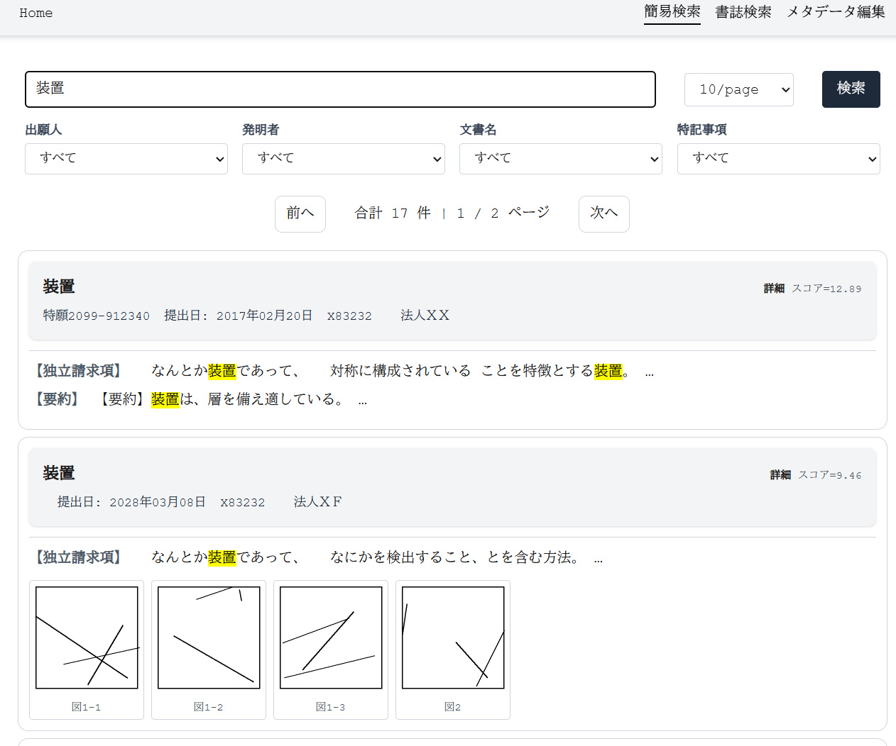
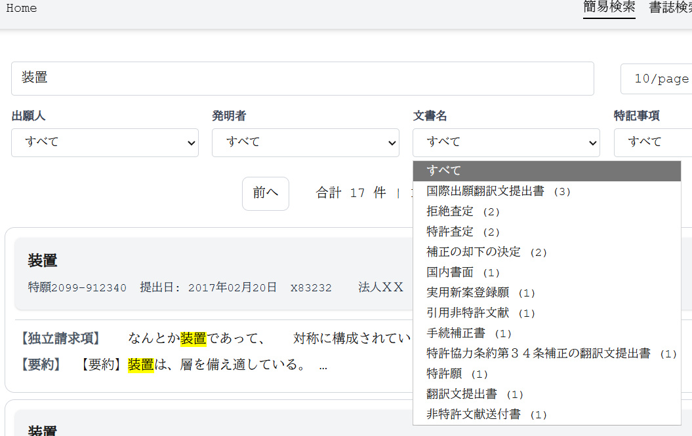
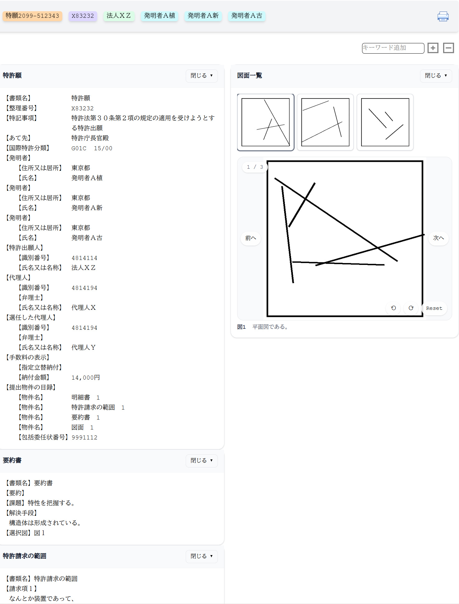
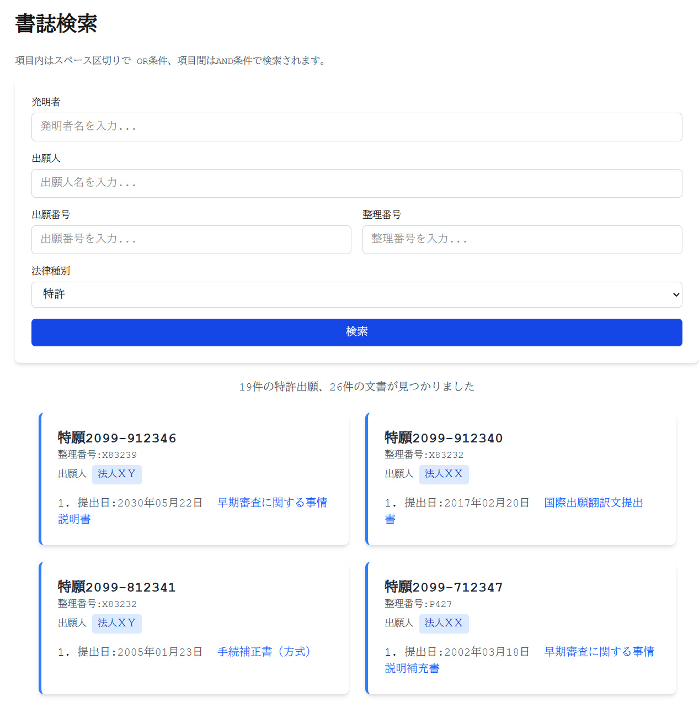
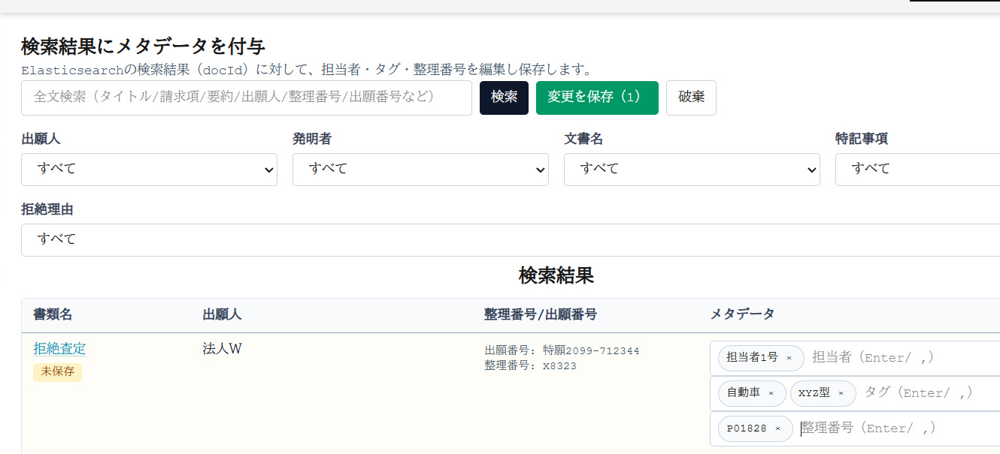
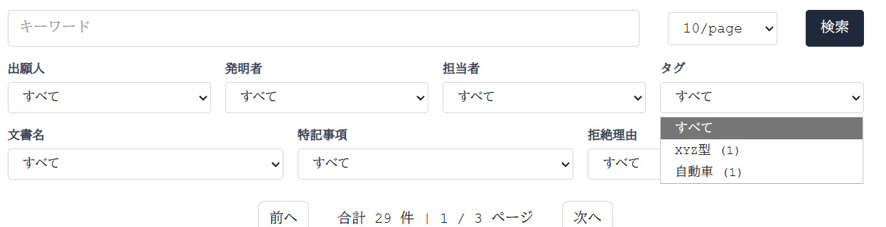

# 特許文書の全文検索システム
** まだ 動作確認中のため以下のとおりインストールを進められないし、動作しません。**

特許出願、意見書等の特許文書の全文検索システム
[インターネット出願ソフト](https://www.pcinfo.jpo.go.jp/site/)を使って提出/受信した明細書、意見書などを検索するシステム作ってみた。

## 特徴
 - 明細書、意見書等を全文検索
 - それってjplatpatで十分では？ → 未公開の自社・顧客案件を検索したいときに使える
 - 検索結果は図面一覧がでるので、図面をぱっとみで探したい人は幸せかもしれん
 - 文書単位（出願単位ではない）で担当者、タグを付けられる
### 全文検索
空白区切りでAND検索。こんな感じで結果一覧がでてくる。明細書の図面のサムネールが表示される。


文書名などで絞込ができる。



「詳細」をクリックするとjplatpat っぽく文書を表示する。


### 書誌検索
発明者、出願人などで検索できる。出願単位で文書が纏められて表示される。


### メタデータ編集
担当者、タグ、整理番号をメタデータっていってます。

全文検索は、提出/受領した文書に書いてあることが検索対象です。だけど、
 - 担当者で検索したい
 - 願書に記載した客先の整理番号の他に、自社の整理番号でも検索したい
 - 明細書に書いてない業界用語的な語で分類したい
なんてことがある（よね？）とおもうので、それを文書単位で付けられるようにした。

メタデータの編集はこんな感じ


メタデータを使った絞込

                                   
## 動作環境
### 動作イメージ

 - 全文検索システムに、インターネット出願ソフトのデータをコピーしておく
   * インターネット出願ソフトのパソコンに共有フォルダを設定し、全文検索システムから共有フォルダ経由でアクセス
   * FTP, SSHなどなんでもすきな方法使ってok
 - ユーザはブラウザを使って、全文検索システムにアクセスし、検索する。
 - **全文検索システムは、ID/パスワードとか認証はない,誰でもアクセスできる**
 - 社内 LAN で使用することを想定している。VPS に全文検索システムをセットアップしてもいいけど、VPNだけでアクセスできるようにするとかしてください。

### 動作環境
 全文検索システムのスペック。たくさんの動作環境でテストしてない。全文検索にelasticsearchを使っているので、elasticsearchの推奨スペックを参考にすればいいかも？ いま動かしてる環境は次のとおり。
 - CPU: AMD Ryzen 3 4300G
 - Memory: 32GB
 - Storage: 1TB SSD, HDD 100GB 以上
   * 全文検索システムで約2GBぐらい
   * 特許願 4500件ぐらい、その他文書 15000件ぐらいで、11GBぐらい
 - OS: Ubuntu 24 2.04 LTS
 - 必要ソフトウェア: git, Docker 28
 
 Docker が動作すればok, Windows WSL, Docker Desktop for Windows でも動くかも。

## 必要ソフトウェアのインストール
### 1. Docker
公式サイトみてインストールして・・・
[Docker公式サイト](https://docs.docker.com/engine/install/ubuntu/) より引用
#### Setup Docker's apt repository
```bash
# Add Docker's official GPG key:
sudo apt update
sudo apt install ca-certificates curl
sudo install -m 0755 -d /etc/apt/keyrings
sudo curl -fsSL https://download.docker.com/linux/ubuntu/gpg -o /etc/apt/keyrings/docker.asc
sudo chmod a+r /etc/apt/keyrings/docker.asc
```

#### Add the repository to Apt sources:
```bash
sudo tee /etc/apt/sources.list.d/docker.sources <<EOF
Types: deb
URIs: https://download.docker.com/linux/ubuntu
Suites: $(. /etc/os-release && echo "${UBUNTU_CODENAME:-$VERSION_CODENAME}")
Components: stable
Signed-By: /etc/apt/keyrings/docker.asc
EOF

sudo apt update
```

#### Add docker packages.
```bash
sudo apt install docker-ce docker-ce-cli containerd.io docker-buildx-plugin docker-compose-plugin
```

#### 一般ユーザで Docker を使えるようにする。
```bash
$ getent group | grep docker
docker:x:999:
$ sudo usermod -aG docker $USER
$ getent group | grep docker
docker:x:999:yoshi
```

ログインしなおして、動作確認
```bash
$ docker run hello-world

Unable to find image 'hello-world:latest' locally
latest: Pulling from library/hello-world
17eec7bbc9d7: Pull complete
Digest: sha256:85404b3c53951c3ff5d40de0972b1bb21fafa2e8daa235355baf44f33db9dbdd
Status: Downloaded newer image for hello-world:latest

Hello from Docker!
This message shows that your installation appears to be working correctly.
...
```

### 2. git
```bash
sudo apt update
sudo apt install -y git
```

## 全文検索システムのインストール・設定
### インターネット出願ソフトが動作するパソコンからデータをコピーする
全文検索システムの適当なディレクトリにデータをコピーしてください。
ssh, SFTP, sambaなんでもOK。
インターネット出願ソフトのデータ（のバックアップとかでもいいけど）があるディレクトリを共有し、全文検索システムがその共有ディレクトリをマウントしてもよい。
以下、インターネット出願ソフトのデータがあるディレクトリを /src とする。
```bash
find /src
/src/ITAK.JP0/APPL.JP1/利用者１.J01/ACCEPT.J04/209910417411209420_A163_____X123412340__123457891_____AAA.JWX
...
```
こんな感じでC:\JPODATA とかにあるデータが全文検索システムからみえればおｋ

### 全部検索システムのインストール
全文検索システムは、一般ユーザーで動作する。システムを動作するディレクトリを適当に決めてください。
100GB以上空きがあるようなディレクトリ推奨. ここでは /home/hoge にインストールする。

```bash
cd /home/hoge
git clone https://github.com/hyperion13th144m/phantom-release
```

### 全部検索システムの設定
設定ファイルをコピーし編集する
```bash
cd phantom-release
cp env.sample .env
vi .env
```
.env は 一箇所 SRC_DIR に /src を設定する。その他は基本変えなくてよい。
```bash
cat .env
### please set path to src directory ###
SRC_DIR=/src

### change as you like
NGINX_PORT=8080

### do not change below values
MODE=production
KIND_OF_DATA=real
DATA_DIR=./var/data
EXTRA_DATA_DIR=./var/extra-data
LOG_DIR_MONA=./var/log/mona
LOG_DIR_FOX=./var/log/fox
LOG_DIR_PANTHER=./var/log/panther
LOG_DIR_JOKER=./var/log/joker
SQLITE_NAME=extra-data.sqlite3

ES_USER=elastic
ES_PASSWORD=elastic
ES_INDEX=patent-documents
MEM_LIMIT=1073741824
```

### 全文検索システムイメージダウンロード
```bash
docker compose pull
```
全文検索システムを動作させるためのイメージファイルをダウンロードします。2GBぐらいあります。

### 全文検索システム起動
```bash
./scripts/start.sh
```

### 初回設定
./scripts/start.sh のあとしばらく時間をおいて、elasticsearch のインデックスを作成する。
(一回実行すればいい。バージョンアップのときに実行することがあるかも。)
```
./scripts/setup.sh
```
これでセットアップ完了

start.sh のあとすぐに実行すると、elasticsearch が起動完了してないので失敗することも。


## 全文検索システムの運用
 以下は、全文検索システムの運用に必要な作業。
 - 特許文書を収集する
 - 特許文書をデータベースに登録する
 - バックアップ
 収集、登録は、スクリプトを cron 実行してもよい。

### 特許文書の収集
インターネット出願ソフトで送信・受信したファイルが増えるたびとか適当な間隔で, 以下を実行する。
```bash
./scripts/crawl.sh
```

文書の数やハードウェアスペックによるが、明細書4,500件、その他の文書15,000件ぐらいで、2時間ぐらいかかった。一回収集した文書は、2回目以降の収集で対象にならない。2回目以降は、増えた分だけ収集する感じ。

### 特許文書をデータベースに登録する
```bash
./scripts/upload.sh
```
こちらは、収集ほど時間は掛からない。


### バックアップ
メタデータは、phantom-release/var/extra-data/ ディレクトリに保存されている。
このファイルをどこかコピーとっておいてください。

phantom-release/var/data に全文検索で表示される文書や画像が保存されているが、これはバックアップとらなくてもよい。
仮にvar/data が壊れたりしても、収集・登録をやり直やり直せば良いため。


### メタデータの復旧
バックアップしたファイルを　var/extra-data に保存する。
次のようにスクリプトを実行する。
```bash
./scripts/setup.sh
./scripts/crawl.sh
./scripts/upload.sh
./scripts/extra-data.sh
```

## 検索
PCのブラウザから http://192.168.1.1:8080 にアクセスする。
192.168.1.1 は 全文検索システムをインストールしたUbuntuのIPアドレスに置き換えて。


- 簡易検索: スペース区切りで AND 検索。
- 書誌検索: 発明者、詳細検などで検索
- メタデータ編集: 文書単位で担当者、タグ、整理番号を追加する。

## 取り込みされる文書
出願・提出済み、受領した文書が対象です。未出願・未提出のチェック中の文書は取り込まれません。
次の文書が取り込まれます。
- 発送系
  * 特許査定
  * 拒絶査定
  * 拒絶理由通知書
  * 補正却下の決定
  * 引用非特許文献
  * 実用新案技術評価の通知
- 出願系
  * 特許願
  * 実用新案登録願
  * 翻訳文提出書
  * 国内書面
  * 国際出願翻訳文提出書
- 補正書系
  * 手続補正書（方式）,手続補正書
  * 手続補正書 特許
  * 手続補正書 実案
  * 特許協力条約第３４条補正の翻訳文提出書
  * 特許協力条約第１９条補正の写し提出書
  * 特許協力条約第３４条補正の写し提出書
- 意見書系
  * 意見書
- その他系
  * 上申書
  * 早期審査に関する事情説明書
  * 早期審査に関する事情説明補充書
 
## 注意事項
- インターネット出願ソフトのデータは、表示・検索用のデータを取り出すために参照されます。変更は一切加えません。
- テストは十分でない、素人が見よう見まねで作ってるのでいろいろバグあるとおもう。あ、AIの力借りて作ってます。
- インターネット出願ソフトと同様に表示されるようにしているが、まったく同じでないです。特に発送系はほとんど調整してないや。HTMLはあくまで参考用に。
- インターネット出願ソフトのデータは、外部のクラウド等に送信していません。ソース公開しているのでそれを確認できます。
- 予告なく公開停止することがあります。
- アップデートにより、再度、文書の収集・登録が必要になりそれなりの時間とらせるかも。
- アプリで何らかの損害を被っても本アプリ作者は責任を負いません。
- 取り込みでエラーがでたり、検索結果がおかしかったり、文書の表示がおかしかったら、レポートいただけると対応できるかも。レポートは [GitHub Issue](https://github.com/hyperion13th144m/phantom/issues) でできるとおもう。

## License
詳細は、[ライセンス](LICENSE.md)をみてください。