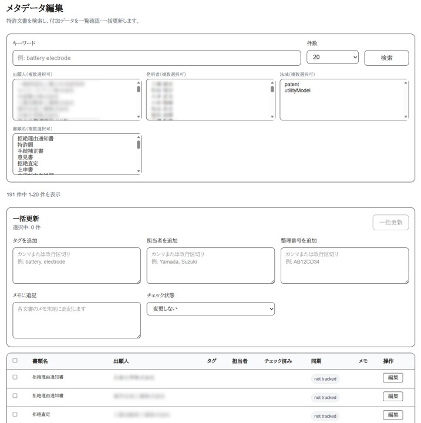
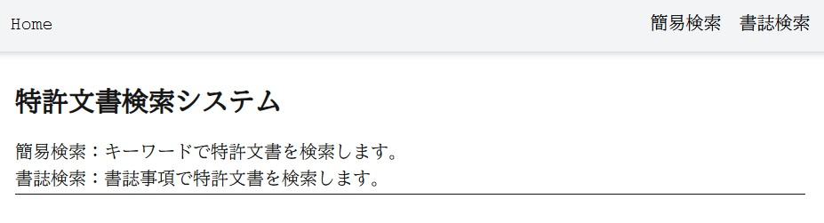
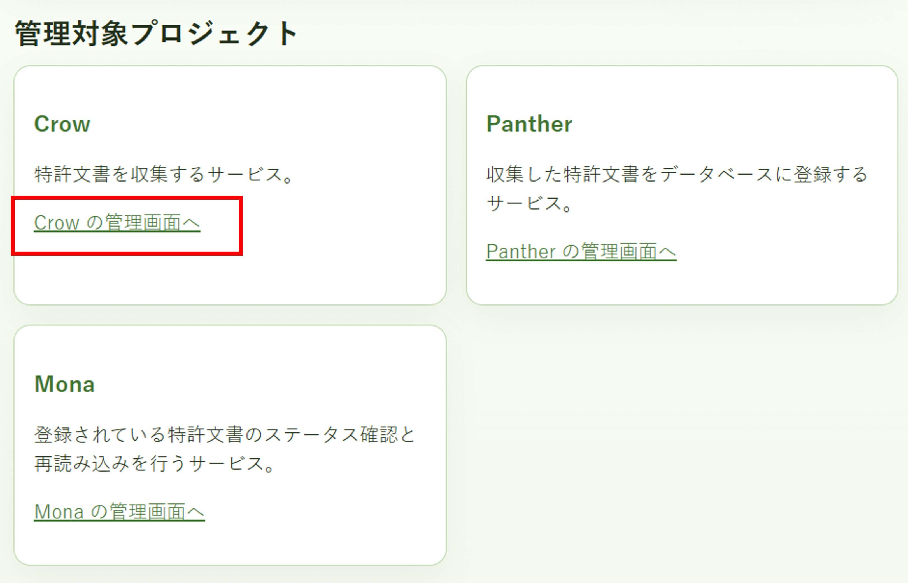
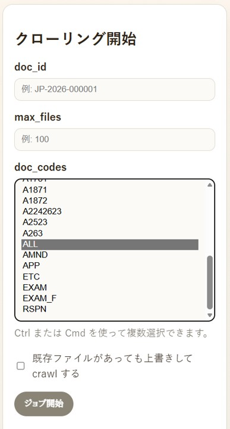
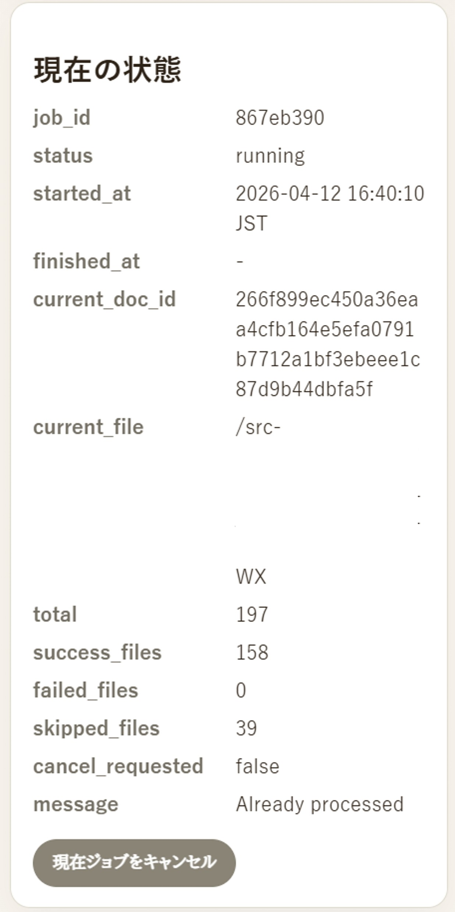
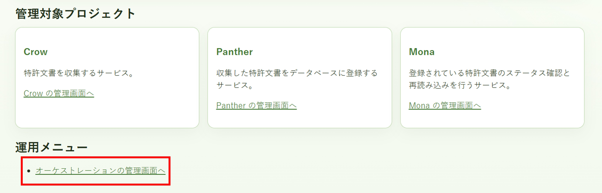
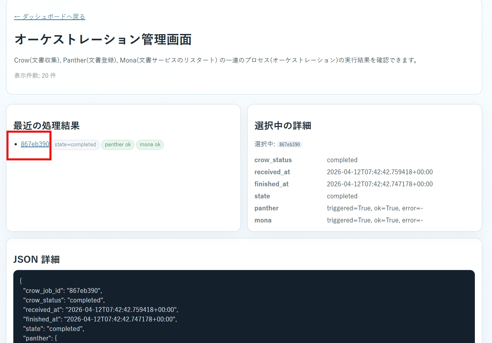
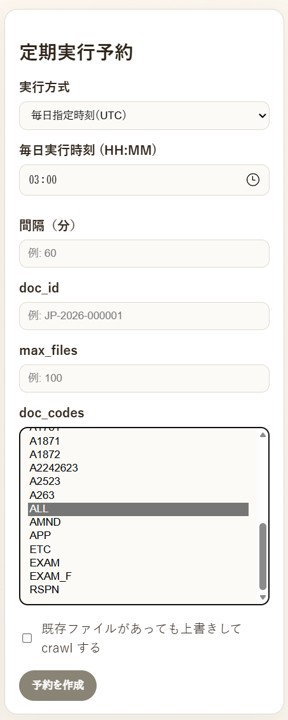
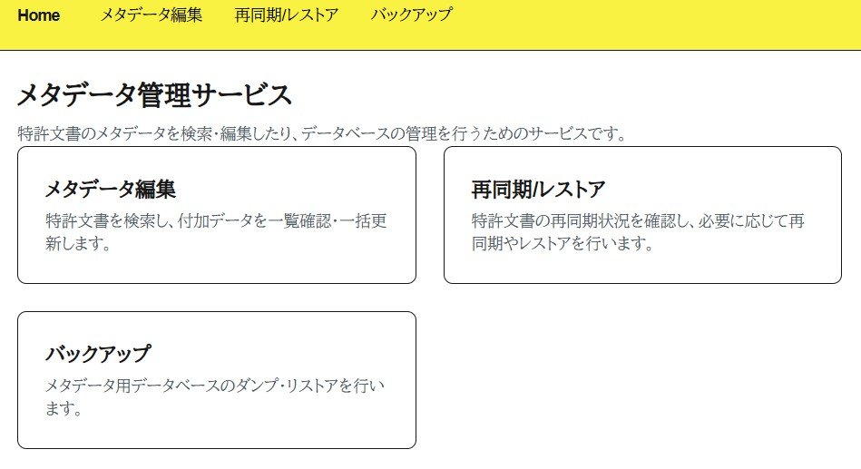

# 特許文書の全文検索システム
This repository contains the distribution files for phantom.
Source code is available at:
[https://github.com/hyperion13th144m/phantom](https://github.com/hyperion13th144m/phantom)

phantom-release provides the minimal runtime environment (compose, scripts, configs) required to run the phantom patent search system without building it from source.

特許出願、意見書等の特許文書の全文検索システム
[インターネット出願ソフト](https://www.pcinfo.jpo.go.jp/site/)を使って提出/受信した明細書、意見書などを検索するシステム作ってみた。

## 1. 特徴
 - 明細書、意見書等を全文検索
 - それってjplatpatで十分では？ → 未公開の自社・顧客案件を検索したいときに使える
 - 検索結果は図面一覧がでるので、図面をぱっとみで探したい人は幸せかもしれん
 - 文書単位（出願単位ではない）で担当者、タグを付けられる

### 1.1 全文検索
空白区切りでAND検索。こんな感じで結果一覧がでてくる。明細書の図面のサムネールが表示される。


文書名などで絞込ができる。


「詳細」をクリックするとjplatpat っぽく文書を表示する。


### 1.2 書誌検索
発明者、出願人などで検索できる。出願単位で文書が纏められて表示される。


### 1.3 メタデータ編集
担当者、タグ、整理番号をメタデータっていってます。

全文検索は、提出/受領した文書に書いてあることが検索対象です。だけど、
 - 担当者で検索したい
 - 願書に記載した客先の整理番号の他に、自社の整理番号でも検索したい
 - 明細書に書いてない業界用語的な語で分類したい
なんてことがあるので、それを文書単位で付けられるようにした。

メタデータの編集はこんな感じ



メタデータを使った絞込


                                   
## 2. 動作環境
### 2.1 動作イメージ

 - 全文検索システムに、インターネット出願ソフトのデータをコピーしておく
   * インターネット出願ソフトのパソコンに共有フォルダを設定し、全文検索システムから共有フォルダ経由でアクセス
   * FTP, SSHなどなんでもすきな方法使ってok
 - ユーザはブラウザを使って、全文検索システムにアクセスし、検索する。
 - **全文検索システムは、ID/パスワードとか認証はない,誰でもアクセスできる** 必要ならnginxのbasic認証とか、SSL設定してください。
 - 社内 LAN で使用することを想定している。VPS に全文検索システムをセットアップしてもいいけど、VPNだけでアクセスできるようにする。

### 2.2 必要ハードウェア・ソフトウェア
 全文検索システムのスペック。たくさんの動作環境でテストしてない。全文検索にelasticsearchを使っているので、elasticsearchの推奨スペックを参考にすればいいかも？ いま動かしてる環境は次のとおり。
 - CPU: AMD Ryzen 3 4300G
 - Memory: 32GB
 - Storage: 1TB SSD, HDD 100GB 以上
   * 全文検索システムで約2GBぐらい
   * 特許願 4500件ぐらい、その他文書 15000件ぐらいで、11GBぐらい
 - OS: Ubuntu 24 2.04 LTS
 - 必要ソフトウェア: git, Docker 28
 
 Docker が動作すればok, Windows WSL, Docker Desktop for Windows でも動くかも。

## 3. 必要ソフトウェアのインストール
### 3.1 Docker
公式サイトみてインストールして・・・
[Docker公式サイト](https://docs.docker.com/engine/install/ubuntu/) より引用
#### Setup Docker's apt repository
```bash
# Add Docker's official GPG key:
sudo apt update
sudo apt install ca-certificates curl
sudo install -m 0755 -d /etc/apt/keyrings
sudo curl -fsSL https://download.docker.com/linux/ubuntu/gpg -o /etc/apt/keyrings/docker.asc
sudo chmod a+r /etc/apt/keyrings/docker.asc
```

#### Add the repository to Apt sources:
```bash
sudo tee /etc/apt/sources.list.d/docker.sources <<EOF
Types: deb
URIs: https://download.docker.com/linux/ubuntu
Suites: $(. /etc/os-release && echo "${UBUNTU_CODENAME:-$VERSION_CODENAME}")
Components: stable
Signed-By: /etc/apt/keyrings/docker.asc
EOF

sudo apt update
```

#### Add docker packages.
```bash
sudo apt install docker-ce docker-ce-cli containerd.io docker-buildx-plugin docker-compose-plugin
```

#### 一般ユーザで Docker を使えるようにする。
```bash
$ getent group | grep docker
docker:x:999:
$ sudo usermod -aG docker $USER
$ getent group | grep docker
docker:x:999:hoge
```

ログインしなおして、動作確認
```bash
$ docker run hello-world

Unable to find image 'hello-world:latest' locally
latest: Pulling from library/hello-world
17eec7bbc9d7: Pull complete
Digest: sha256:85404b3c53951c3ff5d40de0972b1bb21fafa2e8daa235355baf44f33db9dbdd
Status: Downloaded newer image for hello-world:latest

Hello from Docker!
This message shows that your installation appears to be working correctly.
...
```

### 3.2 git
```bash
sudo apt update
sudo apt install -y git
```

## 4. 全文検索システムのインストール・設定
### 4.1 インターネット出願ソフトが動作するパソコンからデータをコピーする
全文検索システムの適当なディレクトリにデータをコピーする。
ssh, SFTP, sambaなんでもOK。
インターネット出願ソフトのデータ（のバックアップとかでもいいけど）があるディレクトリを共有し、全文検索システムがその共有ディレクトリをマウントしてもよい。
以下、インターネット出願ソフトのデータがあるディレクトリを /src とする。
```bash
find /src
/src/ITAK.JP0/APPL.JP1/利用者１.J01/ACCEPT.J04/209910417411209420_A163_____X123412340__123457891_____AAA.JWX
...
```
こんな感じでC:\JPODATA とかにあるデータが全文検索システムからみえればおｋ

### 4.2 全文検索システムのインストール
全文検索システムは、一般ユーザーで動作する。システムを動作するディレクトリを適当に決める。
100GB以上空きがあるようなディレクトリ推奨. ここでは /home/hoge にインストールする。

```bash
cd /home/hoge
git clone https://github.com/hyperion13th144m/phantom-release -b ****
```
-b **** はバージョン番号。最新リリース （例えば v.1.0.1）を指定する。

### 4.3 全文検索システムの設定
設定ファイルをコピーし編集する
```bash
cd phantom-release
cp env.sample .env
vi .env
```
.env は 一箇所 SRC_DIR に /src を設定する。その他は基本変えなくてよい。
```bash
cat .env
### please set path to src directory ###
SRC_DIR=/src

### change as you like
NGINX_PORT=8080

### do not change below values
DATA_DIR=./var/data
EXTRA_DATA_DIR=./var/extra-data
LOG_DIR_CROW=./var/log/crow
LOG_DIR_MONA=./var/log/mona
LOG_DIR_NAVI=./var/log/navi
LOG_DIR_FOX=./var/log/fox
LOG_DIR_PANTHER=./var/log/panther
LOG_DIR_JOKER=./var/log/joker
LOG_DIR_SKULL=./var/log/skull
LOG_DIR_NOIR=./var/log/noir
SQLITE_NAME=extra-data.sqlite3

ORCHESTRATION_WEBHOOK_SECRET=1234567890abcdef
NAVI_ORCHESTRATION_WEBHOOK_URL=http://navi:8000/orchestration/crow-completed
NAVI_ORCHESTRATION_WEBHOOK_TIMEOUT_SECONDS=5

ES_USER=elastic
ES_PASSWORD=elastic
ES_INDEX=patent-documents
MEM_LIMIT=1073741824
```

### 全文検索システムイメージダウンロード
```bash
docker compose pull
```
全文検索システムを動作させるためのイメージファイルをダウンロードする。2GBぐらい。

## 4.4 全文検索システム起動
```bash
./scripts/start.sh
```
`start.sh` は各種サービスを起動します。

### 4.5 (補足) マッピングを再適用したいとき
start.sh は Elasticsearch の起動完了を待って、`infra/es/generated/mapping.json` を使ったインデックス作成まで自動で行う。
すでにインデックスが存在する場合は、既存データを残したままマッピング適用をスキップする。
インデックスが未作成の状態でマッピングを適用したいときは以下を実行する。
```bash
./scripts/setup.sh
```
既存インデックスを削除して強制的に再作成したいときは、`-f` を付けて実行する。
```bash
./scripts/es.sh -f
```


## 5. 全文検索システムの機能
全文検索システムを起動しているコンピュータにブラウザでアクセスします。
```
http://192.168.1.1:8080
```
192.168.1.1 はコンピュータのIPアドレス、8080 は.env NGINX_PORT に指定したポート番号です。SSL (https) ではありません、認証もありません。

次の3つのメニューがあります
- 全文検索
- メタデータ編集
- 管理画面


### 5.1 全文検索
全文検索のHomeページ


特許文書の検索をすることができます。
 - 簡易検索
   - キーワードで特許文書を検索することができます。
 - 書誌検索
   - 書誌事項で特許文書を検索します。

### 5.2 管理画面
#### 管理画面


この管理画面では、
 - クローリング開始：インターネット出願ソフトで送受信したファイルを収集し、データベースに登録することができる
 - 定期実行予約：クローリング開始を定期的に実行することができる

基本的には、[Crow の管理画面へ] だけ使えば良い。

#### 収集・登録
「クローリング開始」のdoc_codes に 「ALL」を選択し、「ジョブ開始」をクリックする。



収集がスタートするとこのような画面になる。収集の進捗がわかる。



画面移動してもOKなので、「オーケストレーションの管理画面へ」で収集したファイルの数や、登録に成功したファイルの数などがわかる。




文書の数やハードウェアスペックによるが、明細書4,500件、その他の文書15,000件ぐらいで、2時間ぐらいかかった。

#### 定期実行予約


「ジョブ開始」は、インターネット出願ソフトで送受信したファイルが増えるたびに実行する必要がある。めんどうなら、「定期実行予約」で
 - 実行方式：毎日指定時刻
 - 毎日実行時刻：適当な時間
 - doc_codes： ALL
 を指定し、「予約を作成」をクリックする。

基本はこれで特許文書の収集、登録が行われる。Panther,Monaの管理画面で作業する必要はない。

### 5.3 メタデータ管理


特許文書に、担当者、タグ、追加の整理番号、memoを付与できます。これらの担当者等をメタデータといってます。
 - メタデータ編集: 担当者等を付与することができる
 - 再同期/レストア：メタデータ編集でメタデータを付与したが、なんらかの原因でデータベースに反映されなかった場合、そのメタデータをデータベースに反映させることができる
 - バックアップ：メタデータのバックアップをすることができます

メタデータは定期的にバックアップしてください。なお
phantom-release/var/data に全文検索で表示される文書や画像が保存されているが、これはバックアップとらなくてもよい。
仮にvar/data が壊れたりしても、収集・登録をやり直やり直せば良いため。


## 6. データが壊れたときなど復旧
```bash
./scripts/start.sh
./scripts/es.sh -f
```
ついで管理画面にて ［Crowの管理画面へ］→［クローリング開始］
- doc_codes: ALL
- 「既存ファイルがあっても上書きしてcrawlする」にチェック
として「ジョブ開始」

メタデータ管理にて
 - 「バックアップ」
 - ［リストア］
 - ［ファイルの選択］をクリックしてバックアップしたデータを選択
 - ［リストア］ボタンをクリックする


## 7. 取り込みされる文書
出願・提出済み、受領した文書が対象です。未出願・未提出のチェック中の文書は取り込まれない。
次の文書が取り込まれる。
- 発送系
  * 特許査定
  * 拒絶査定
  * 拒絶理由通知書
  * 補正却下の決定
  * 引用非特許文献
  * 実用新案技術評価の通知
- 出願系
  * 特許願
  * 実用新案登録願
  * 翻訳文提出書
  * 国内書面
  * 国際出願翻訳文提出書
- 補正書系
  * 手続補正書（方式）
  * 手続補正書 特許
  * 手続補正書 実案
  * 特許協力条約第３４条補正の翻訳文提出書
  * 特許協力条約第１９条補正の写し提出書
  * 特許協力条約第３４条補正の写し提出書
- 意見書系
  * 意見書
- その他系
  * 上申書
  * 早期審査に関する事情説明書
  * 早期審査に関する事情説明補充書
 
## 8. 注意事項
- インターネット出願ソフトのデータは、表示・検索用のデータを取り出すために参照される、変更は一切加えない。
- テストは十分でない、素人が見よう見まねで作ってるのでいろいろバグあるとおもう。AIの力借りて作ってる。
- インターネット出願ソフトと同様に表示されるようにしているが、まったく同じでない。特に発送系はほとんど調整してない。HTMLはあくまで参考用に。
- インターネット出願ソフトのデータは、外部のクラウド等に送信していない。ソースでそれを確認できます。
- 予告なく公開停止することがある。
- アップデートにより、再度、文書の収集・登録が必要になりそれなりの時間とらせるかも。
- アプリで何らかの損害を被っても本アプリ作者は責任を負いません。
- 取り込みでエラーがでたり、検索結果がおかしかったり、文書の表示がおかしかったら、レポートいただけると対応できるかも。レポートは [GitHub Issue](https://github.com/hyperion13th144m/phantom/issues) でできるとおもう。

## 9. License
詳細は、[ライセンス](LICENSE.md)をみてください。
