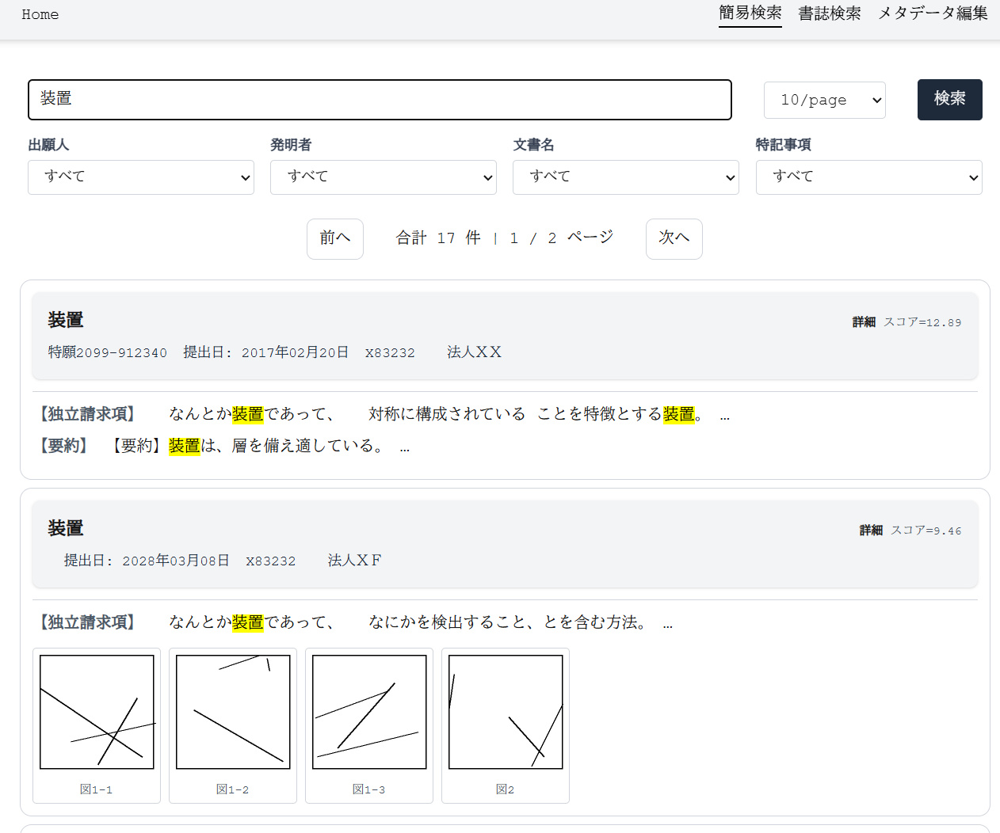
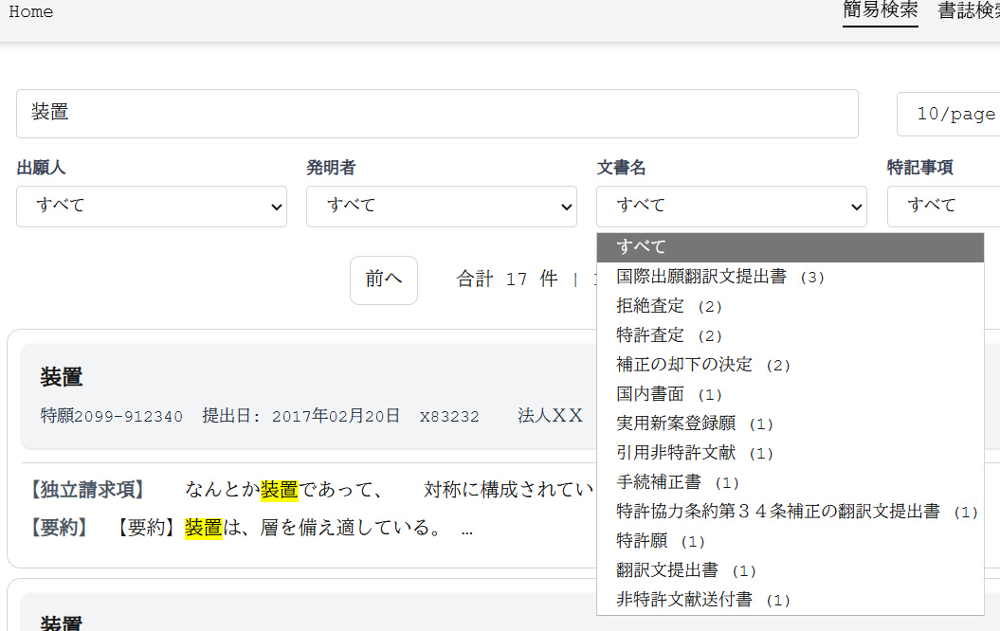
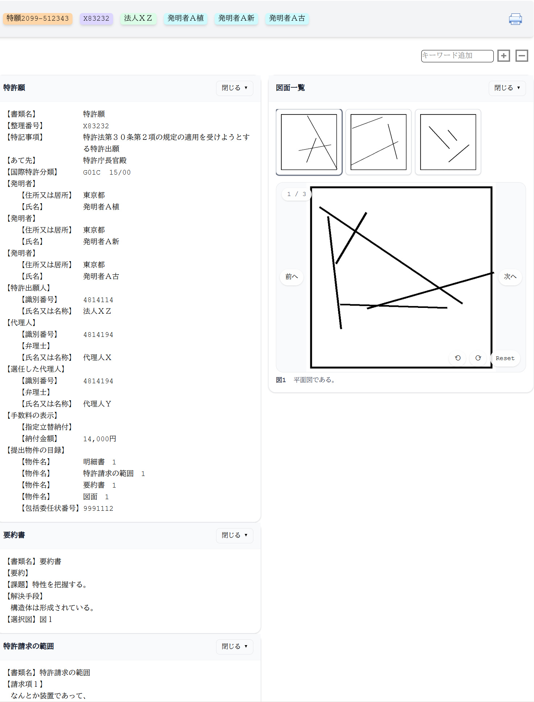
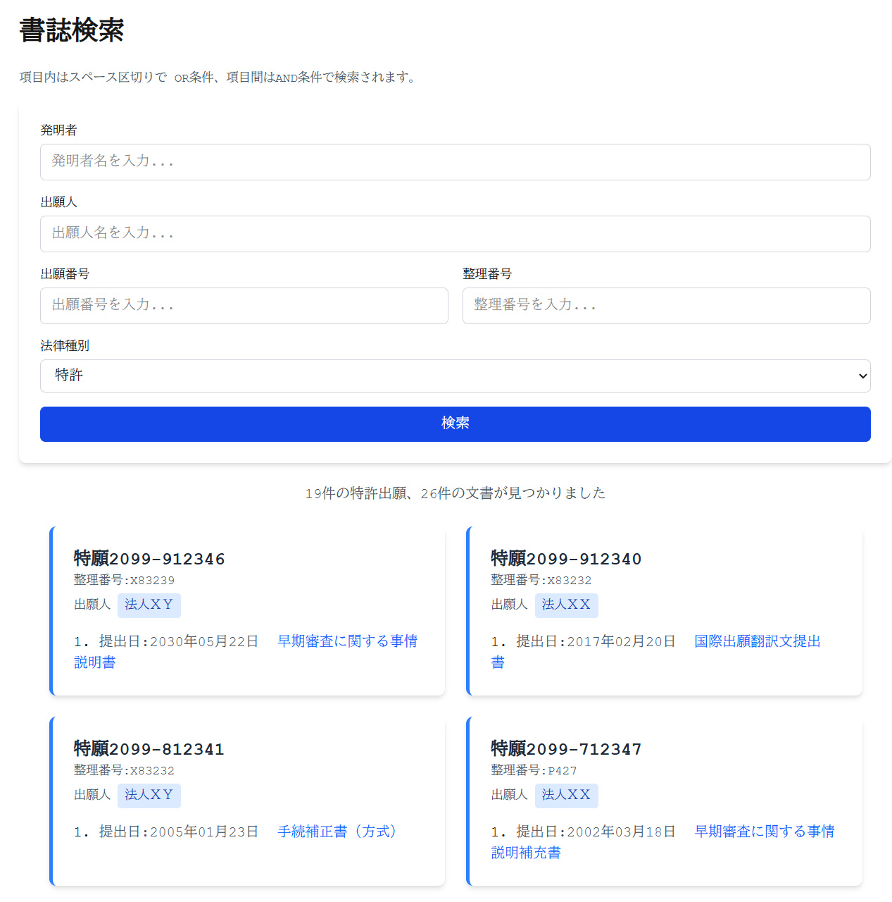
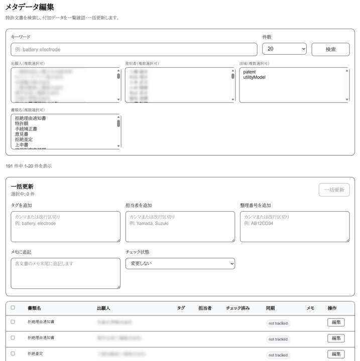

# 特許文書の全文検索システム

本システムは、[インターネット出願ソフト](https://www.pcinfo.jpo.go.jp/site/)で提出・受領した特許文書を取り込み、ブラウザから全文検索・を行うことができます。

社内 LAN などの閉じた環境で検索する用途を想定しています。検索結果では明細書などの本文だけでなく、図面サムネイルも確認できます。

Source code:
[https://github.com/hyperion13th144m/phantom](https://github.com/hyperion13th144m/phantom)

## できること

- 明細書、意見書、拒絶理由通知書などの全文検索
- 発明者、出願人などの書誌検索
- 文書単位の担当者、タグ、整理番号、メモの管理
- インターネット出願ソフトの送受信データの収集・検索 index 登録
- 画像検索（精度は調整中）

## 動作概要

```mermaid
flowchart LR
    A[ブラウザ（Windows PC等）] <--> B[全文検索システム（Linux）]
    B[全文検索システム（Linux）] <--> C[インターネット出願ソフトのデータ（Windows PC）]
```

全文検索システムは、インターネット出願ソフトのデータを参照して表示・検索用データを作成します。元データは変更しません。

認証機能は標準ではありません。社内 LAN や VPN 内での利用を想定しています。必要に応じて nginx の Basic 認証や HTTPS を設定してください。

## 画面イメージ

### 全文検索
全文検索の結果には図面サムネイルも表示されます。

### 絞込
文書名などで絞り込みできます。

### 詳細表示
「詳細」から文書本文を表示できます。

### 書誌検索
発明者や出願人などで検索できます。

### メタデータ
メタデータ（担当者、タグ、整理番号）を文書に付与できます。

## ドキュメント

- [インストール](docs/INSTALL.md)
- [データ収集・登録・復旧](docs/OPERATION.md)
- [検索システムの使い方](docs/USAGE.md)
- [推奨セキュリティ設定](docs/SECURITY.md)

## 注意・免責

- インターネット出願ソフトのデータは、表示・検索用のデータを取り出すために参照される、変更は一切加えない。
- テストは十分ではありません。不具合が残っている可能性があります。
- インターネット出願ソフトと同様に表示されるようにしているが、まったく同じではありません。特に発送系はほとんど調整していません。HTML はあくまで参考用です。
- インターネット出願ソフトのデータは、外部のクラウド等に送信していない。ソースでそれを確認できます。
- 予告なく公開停止することがある。
- アップデートにより、再度、文書の収集・登録が必要になる場合があります。
- アプリで何らかの損害を被っても本アプリ作者は責任を負いません。

## お問い合わせ / Contact
- バグ・機能要望 → Issues 
  [GitHub Issue](https://github.com/hyperion13th144m/phantom/issues)

- 質問・相談 → Discussions
  [GitHub Discussions](https://github.com/hyperion13th144m/phantom/discussions)

- その他 → hyperion13th144m+phantom [at] gmail.com

## License

詳細は [LICENSE.md](LICENSE.md) を参照してください。
