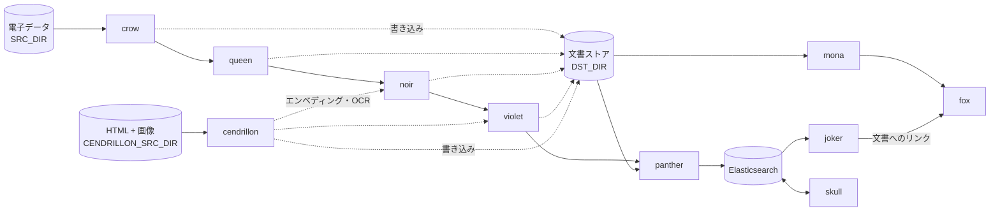

# phantom

特許庁のインターネット出願ソフトで扱う特許文書（電子データ）を取り込み、
全文検索・画像検索できるようにするシステム。
将来的には、担当者・整理番号・技術分類タグ・作業メモなどのメタ情報を管理する
特許管理システムへの発展を見据えている。

[phantom-old](https://github.com/hyperion13th144m/phantom-old) を一から設計し直したもの。

## できること

- インターネット出願ソフトの電子データ（JWX/JWS/JPC/JPD + 対の手続XML）を
  置いておくだけで、展開・変換・エンベディング生成・Elasticsearch 登録までを自動で行う
- **検索** — キーワード / 厳密 / セマンティック / ハイブリッドの簡易検索、
  フィールド単位の詳細検索、図面の画像検索（類似画像検索つき）、書誌検索
- **閲覧** — 文書を HTML でレンダリング（図面カルーセル・目次・キーワードハイライト）
- **メタ情報** — 内部整理番号・外部整理番号・タグ・担当者を文書に紐づけて検索に反映

## 構成

文書の処理は5つのサービスを直列に流れるパイプラインで、
そのあとを検索・閲覧・メタ情報の各サービスが受け持つ。
XML が残っていない文書だけは cendrillon が別ルートで取り込み、panther から先は合流する。


```mermaid
flowchart LR
    SRC[("電子データ<br/>SRC_DIR")] --> crow
    HTMLSRC[("HTML + 画像<br/>CENDRILLON_SRC_DIR")] --> cendrillon
    crow --> queen --> noir --> violet --> panther --> ES[("Elasticsearch")]
    crow -. 書き込み .-> STORE[("文書ストア<br/>DST_DIR")]
    queen -.-> STORE
    noir -.-> STORE
    violet -.-> STORE
    cendrillon -. 書き込み .-> STORE
    cendrillon -. エンベディング・OCR .-> noir
    cendrillon -.-> violet
    STORE --> panther
    STORE --> mona
    ES --> joker
    ES <--> skull
    mona --> fox
    joker -->|文書へのリンク| fox
```

| サービス | 役割 | 種別 |
| --- | --- | --- |
| [crow](https://github.com/hyperion13th144m/phantom/blob/main/services/crow/README.md) | `SRC_DIR` をスキャンし、XML の SHA-256 を文書IDとして `DST_DIR` に展開する | パイプライン |
| [queen](https://github.com/hyperion13th144m/phantom/blob/main/services/queen/README.md) | XML をマージして XSL で JSON 化し、画像を WebP 3サイズに変換する | パイプライン |
| [noir](https://github.com/hyperion13th144m/phantom/blob/main/services/noir/README.md) | 書誌事項・本文テキストを抽出し、文書のエンベディングを計算する | パイプライン |
| [violet](https://github.com/hyperion13th144m/phantom/blob/main/services/violet/README.md) | 画像ごとの図番号・説明・代表図フラグ・OCR・画像エンベディングを生成する | パイプライン |
| [panther](https://github.com/hyperion13th144m/phantom/blob/main/services/panther/README.md) | 各サービスの JSON を突き合わせて Elasticsearch の文書・画像インデックスに登録する | パイプライン |
| [cendrillon](https://github.com/hyperion13th144m/phantom/blob/main/services/cendrillon/README.md) | XML が無く HTML と画像しか残っていない文書を、crow〜violet と同じ形で `DST_DIR` に取り込む。エンベディングと OCR は noir / violet の API に投げる（モデルを二重に常駐させないため） | パイプライン |
| [navi](https://github.com/hyperion13th144m/phantom/blob/main/services/navi/README.md) | パイプライン全体の管制。タスクの開始・中止・進捗と一括実行の UI | 運用 |
| [skull](https://github.com/hyperion13th144m/phantom/blob/main/services/skull/README.md) | メタ情報（整理番号・タグ・担当者）の管理 UI と Elasticsearch への同期 | 運用 |
| [joker](https://github.com/hyperion13th144m/phantom/blob/main/services/joker/README.md) | 検索 UI・検索 API（Astro / SSR） | フロント |
| [fox](https://github.com/hyperion13th144m/phantom/blob/main/services/fox/README.md) | 文書ビューア（Astro / SSR）。XML 由来・HTML 由来のどちらも表示する | フロント |
| [mona](https://github.com/hyperion13th144m/phantom/blob/main/services/mona/README.md) | 文書ストアのファイル配信（JSON・画像） | フロント |

パイプラインの各サービスは
[phantom-taskservice](https://github.com/hyperion13th144m/phantom/blob/main/libs/python/taskservice/README.md) の統一 API
（`POST /tasks` / `GET /tasks/current` / `POST /tasks/current/cancel`）でタスクを操作する。
どのサービスも「出力ファイルがあればスキップ」する冪等な作りなので、
何度実行しても差分だけが処理される。

## リポジトリ構成

uv workspace のモノレポ（fox / joker は npm プロジェクトなので workspace からは除外）。

```
services/            各サービス（crow, queen, noir, violet, cendrillon, panther, navi, skull, joker, fox, mona）
libs/python/         Python 共有パッケージ（taskservice, docstore, jpo_schema）
libs/typescript/     TypeScript 型生成用パッケージ（jpo-schema）
libs/jpo-schema/     特許文書 XML → JSON 変換の XSLT 資産
infra/es/            Elasticsearch のマッピングとプラグイン入りイメージ
infra/nginx/         本番用リバースプロキシ設定
scripts/             型定義・型ガードの生成スクリプト
docs/                手順書（下記）
```

## ドキュメント

| ドキュメント | 内容 |
| --- | --- |
| [開発環境の用意](docs/development.md) | 必要なもの、`uv sync`、環境変数、各サービスの起動、テスト |
| [本番環境のセットアップ](docs/production.md) | docker compose での構築、nginx のルーティング、更新とバックアップ |
| [運用方法](docs/operations.md) | navi でのパイプライン実行、skull でのメタ情報管理と同期 |
| [検索の使い方](docs/search.md) | joker の簡易検索・詳細検索・画像検索・書誌検索 |

## ライセンス

[License 1.0](LICENSE.md) — 非商用利用に限る。
