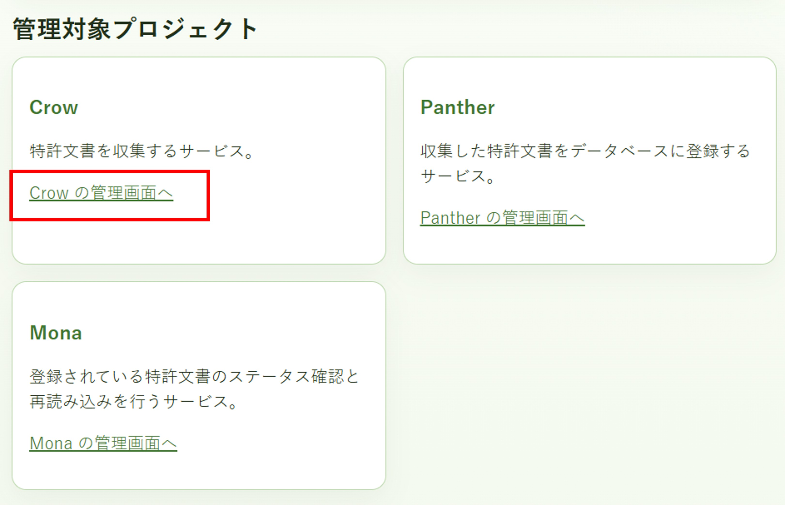
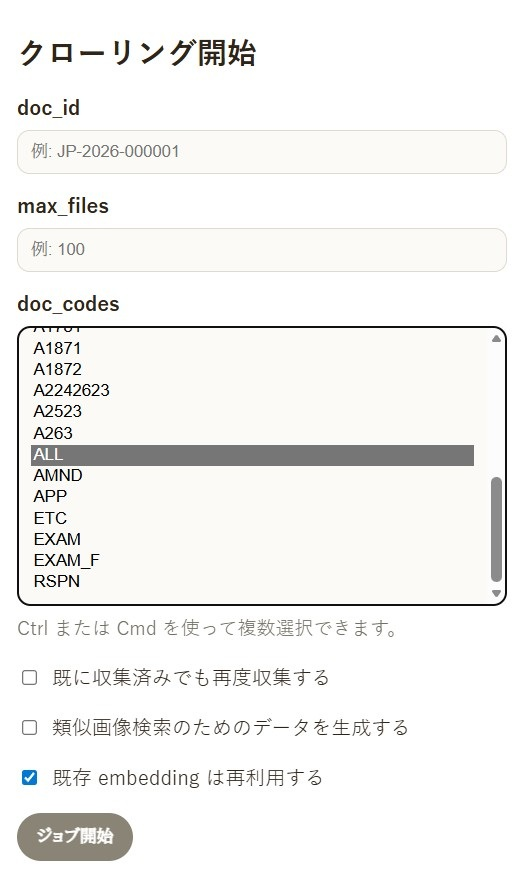
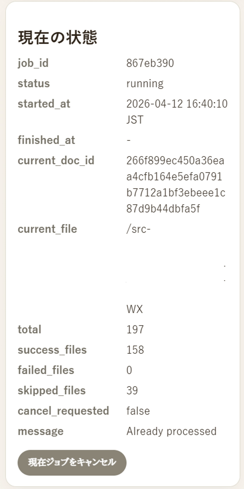
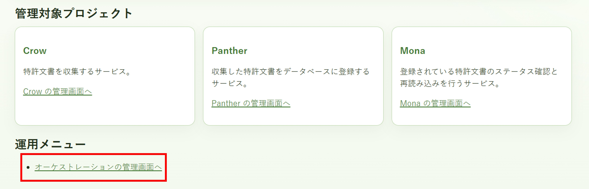
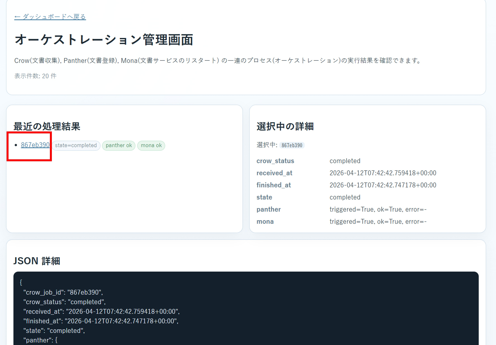
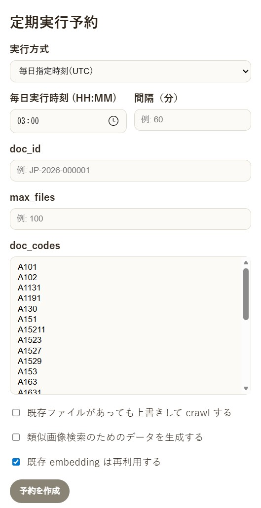

# データ収集・登録

インターネット出願ソフトの送受信データを収集し、データベース（elasticsearch）に登録するための運用手順です。

## 管理画面

全文管理システムのURL http://192.168.0.1:8080 (ホスト名、ポートは環境によって異なります）にアクセスし、「管理画面」に入ります。


収集・登録の流れ
- Crow: インターネット出願ソフトの送受信データから登録用の文書データを生成
- Panther: ↑の文書データをデータベースに登録
- Violet: 画像の検索のために画像登録用のデータを生成
- Panther: ↑の画像登録用データをデータベースに登録

## 収集・登録の手順
「Crow の管理画面へ」を選択します。



通常は Crow の管理画面から操作すれば上記の流れが実行されます。Panther や Mona の管理画面で個別作業する必要はありません。


## 収集・登録の開始
### 設定、開始
管理画面の「クローリング開始」に以下の設定をします。

| 設定項目 | 設定値　| 説明 |
| --- | --- | --- |
| max_files | 任意 | 収集するファイル数の上限。指定しない場合は全件です。 |
| doc_codes | ALL | 収集対象の文書コード。通常は ALL でよいです。必要に応じて、特許願や拒絶理由通知書など、特定の文書コードだけ選択することもできます。 |
| 既に収集済みでも再度収集する | 任意 | チェックを入れると、既に収集済みの文書も再度収集します。通常はオフにしてください。 |
| 類似画像検索のためのデータを生成する | 任意 | チェックを入れると、画像の類似検索のためのデータも生成します。相当な時間が掛かるので、必要に応じて選択してください。例えば初回はチェックを付けず、次回以降にチェックを付けて類似検索のための取り込みを行うことができます。 |
| 既存 embedding は再利用する | 任意 | チェックを入れると、既に作成済みの embedding を再利用します。通常はオンにしてください。Violet で embedding を生成する場合、生成に時間が掛かるため、既存 embedding を再利用する設定にしておくと、Violet で embedding を生成する場合でも、生成済みの embedding を再利用して登録を進めるため、全体の時間を短縮できます。 |

設定したら、「ジョブ開始」をクリックします。



### 進捗確認

収集が始まると、進捗を確認できます。



しばらく時間が掛かります。status が `running` から `idle` に変わるまでお待ちください。

文書数やハードウェアスペックによりますが、明細書 4,500 件、その他文書 15,000 件程度で、登録に 2 時間程度かかった例があります。


## オーケストレーション
「オーケストレーションの管理画面へ」から、収集したファイル数や登録に成功したファイル数などを確認できます。






オーケストレーション画面では、表示中ジョブの全体状況と、`patent-documents` / `patent-images` の進捗を分けて確認できます。

- 特許文書の登録と画像データの登録は別ステップとして表示されます。
- 失敗後は、特許文書の収集から再実行、画像データの生成から再実行、イメージアップロードだけ再実行を選べます。
- オーケストレーション履歴は `LOG_DIR_NAVI/orchestration/pipelines` に保存されます。
- Navi 起動時には、待機中だった Mona/Violet/Panther の完了状態を可能な範囲で確認し、完了済みなら次のステップへ進めます。

詳細な現在仕様は [orchestration-v1-0-33.md](orchestration-v1-0-33.md) を参照してください。

## embedding 生成を使う場合

「類似画像検索のためのデータを生成する」を有効にした場合、画像ベクトルの生成と Elasticsearch への投入はメモリを多く使います。

低スペック環境では、embedding ありの全件一括実行は避け、50〜100 文書程度の `id_list` に分けて Violet/Panther を実行してください。

Panther の `chunk_size` は 50〜100 程度、`request_timeout` は 120 秒以上から試すとよいです。Violet 実行後にメモリが戻りにくい場合は、Panther 実行前に Violet を restart/stop してから進めます。

.env ではデフォルトで以下のように設定されています。
- ES_CHUNK_SIZE=100
- ES_REQUEST_TIMEOUT=120

## 定期実行予約

インターネット出願ソフトで送受信したファイルが増えるたびに、収集ジョブを実行する必要があります。面倒な場合は「定期実行予約」を使います。



設定例:

- 実行方式: 毎日指定時刻
- 毎日実行時刻: 任意の時刻
- `doc_codes`: `ALL`

設定後、「予約を作成」をクリックします。

## 復旧

データベース（Elasticsearch の index) が壊れた場合は、index を再作成して収集・登録をやり直します。

```bash
./scripts/start.sh
./scripts/es.sh -f
```

その後、管理画面で `Crow の管理画面へ` → `クローリング開始` を開きます。

- `doc_codes`: `ALL`
- 「ジョブ開始」をクリック

## メタデータのバックアップと復元

担当者、タグ、整理番号、メモなどのメタデータは定期的にバックアップしてください。

復元するときは、メタデータ管理画面で以下を実行します。

1. 「バックアップ」を開く。
2. 「リストア」を開く。
3. 「ファイルの選択」でバックアップファイルを選択する。
4. 「リストア」ボタンをクリックする。

`phantom-release/var/data` には全文検索で表示される文書や画像が保存されますが、これは収集・登録をやり直せば再生成できます。

## 取り込み対象の文書

出願・提出済み、または受領した文書が対象です。未出願・未提出のチェック中文書は取り込まれません。

発送系:

- 特許査定
- 拒絶査定
- 拒絶理由通知書
- 補正却下の決定
- 引用非特許文献
- 実用新案技術評価の通知

出願系:

- 特許願
- 実用新案登録願
- 翻訳文提出書
- 国内書面
- 国際出願翻訳文提出書

補正書系:

- 手続補正書（方式）
- 手続補正書 特許
- 手続補正書 実案
- 特許協力条約第34条補正の翻訳文提出書
- 特許協力条約第19条補正の写し提出書
- 特許協力条約第34条補正の写し提出書

意見書系:

- 意見書

その他系:

- 上申書
- 早期審査に関する事情説明書
- 早期審査に関する事情説明補充書
