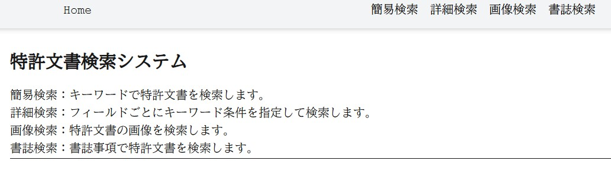
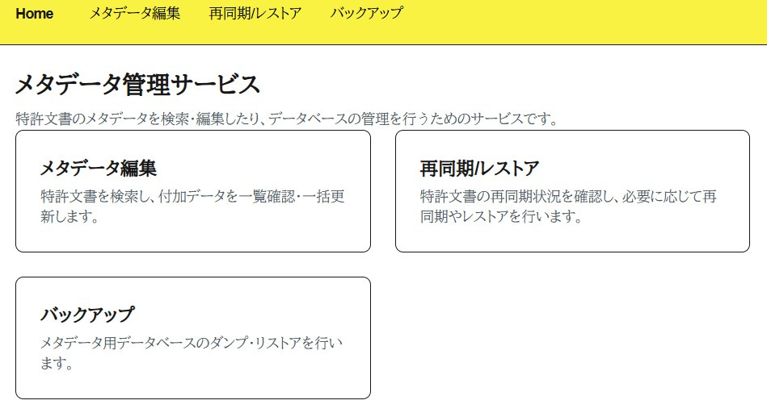
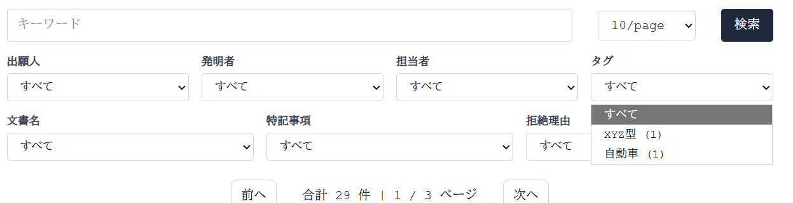

# 検索システムの使い方

全文検索システムを起動しているコンピュータに、ブラウザでアクセスします。

```text
http://192.168.1.1:8080/joker/
```

`192.168.1.1` はコンピュータの IP アドレス、`8080` は `.env` の `NGINX_PORT` に指定したポート番号です。標準では HTTPS ではなく、認証もありません。

## 全文検索

全文検索のホーム画面です。



特許文書の検索ができます。

- 簡易検索: キーワードで特許文書を検索します。
- 詳細検索: 特許請求の範囲など、特定の項目を指定して検索します。
- 画像検索: キーワードで画像検索、類似画像を検索できます。
- 書誌検索: 書誌事項で特許文書を検索します。

### 簡易検索

テキスト入力欄にキーワードを入力し、検索できます。

文書名などで絞り込みできます。


「詳細」をクリックすると、文書本文を表示できます。


### 詳細検索
特許請求の範囲など、特定の項目を指定して検索できます。
各項目は空白区切りで複数のキーワードを入力でき、AND, OR, NEAR 5を適用できます。NEAR 5は、指定したキーワードが前後5語以内にある文書を検索します。
各項目間は AND で結合されます。

### 画像検索
キーワードで画像検索をすることができます。表示された画像について「画像類似」「文脈類似」を選ぶことで、類似画像を検索できます。

画像検索はまだ試行中で、精度は調整中です。

画像検索の仕組みは次の通りです。
- キーワード検索: 明細書のうち図面に言及していると思われる段落を抽出し、画像と対応付けて データベースに登録しています。
- 画像類似：選択した画像と見た目がにている画像を表示します。
- 文脈類似：画像に言及した文言が似ている画像を検索します。

### 書誌検索

発明者、出願人などで検索できます。出願単位で文書がまとまって表示されます。


## 絞込
簡易検索、詳細検索、画像検索、書誌検索では、検索結果をさらに絞り込むことができます。
- タグ: 文書に付与されたタグで絞り込めます。
- 担当者: 文書に付与された担当者で絞り込めます。
- 整理番号: 文書に付与された整理番号で絞り込めます。
- 画像種別: 図面の画像種別で絞り込めます。
- 画像文脈: 図面の関連付けで絞り込めます。
 - 関連文脈なし:本文からその画像への文脈をうまく紐づけられなかった
 - 直接参照あり: 「図1は〜」「図1に示すように〜」のように、その図を直接参照している段落
 - 直接参照＋後続説明あり
    「図1は〜」「図1に示すように〜」のように、その図を直接参照している段落と、その後の段落で説明が続いているもの

## メタデータ管理

担当者、タグ、整理番号、メモなどを文書単位で付与できます。



できること:

- メタデータ編集: 担当者、タグ、整理番号、メモなどを付与する。
- 再同期/レストア: なんらかの原因で Elasticsearch に反映されなかったメタデータを反映する。
- バックアップ: メタデータをバックアップする。

メタデータの編集画面:


メタデータを使った絞り込み:



メタデータは定期的にバックアップしてください。復旧手順は [OPERATION.md](OPERATION.md) を参照してください。
