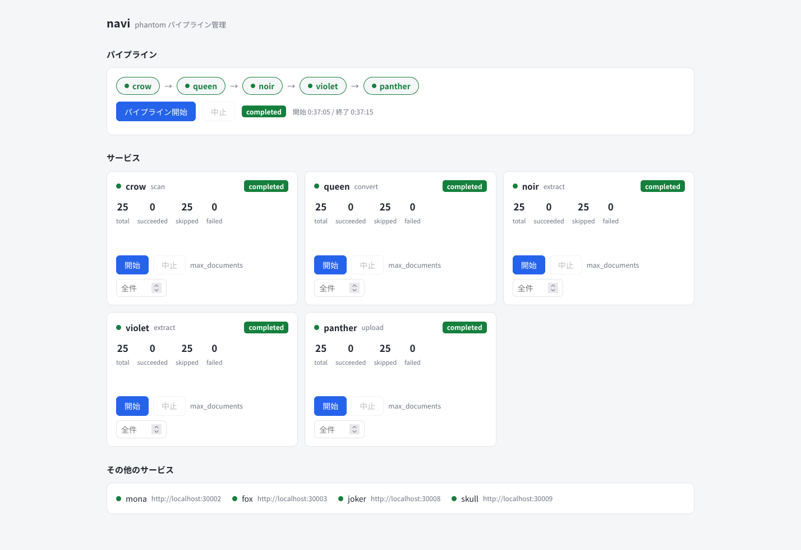

# 開発環境の用意

ローカルで phantom 一式（パイプライン5サービス + 運用2サービス + フロント3サービス）を
動かすまでの手順。本番構築は [本番環境のセットアップ](production.md) を参照。

## 必要なもの

| | バージョン | 用途 |
| --- | --- | --- |
| Python | 3.12 以上 | crow / queen / noir / violet / panther / navi / skull / mona |
| [uv](https://docs.astral.sh/uv/) | 最新 | Python 側のワークスペース管理・実行 |
| Node.js | 22.12 以上 | fox / joker（Astro SSR） |
| Docker | 最新 | Elasticsearch を動かす |
| tesseract | 5 系 | violet の OCR |

tesseract は本体と日本語データが必要。

```bash
sudo apt install tesseract-ocr tesseract-ocr-jpn
tesseract --list-langs   # eng / jpn が出ること
```

ディスクは、依存関係（torch の CPU wheel・HuggingFace のモデル）に数 GB、
文書ストアに文書1件あたり数百 KB〜数 MB を見ておく。

## 1. 依存関係のインストール

```bash
git clone https://github.com/hyperion13th144m/phantom.git
cd phantom
uv sync --all-packages
```

`--all-packages` は必須。uv workspace なので、素の `uv sync` ではルートの依存しか入らず、
各サービスのコマンド（`uv run crow` など）が使えない。**サービスを追加したときも
`uv sync --all-packages` を実行し直すこと。**

fox / joker は npm プロジェクトで、workspace からは除外されている
（ルート `pyproject.toml` の `[tool.uv.workspace] exclude`）。

```bash
(cd services/fox   && npm install)
(cd services/joker && npm install)
```

## 2. 環境変数

`.env.sample` をコピーして編集する。全サービスの環境変数がここに1つにまとまっている。

```bash
cp .env.sample .env
```

最低限、次の3つを自分の環境に合わせる。

| 変数 | 説明 |
| --- | --- |
| `SRC_DIR` | インターネット出願ソフトの電子データがある場所（crow が読む） |
| `DST_DIR` | 文書ストア。crow / queen / noir / violet が書き、mona / panther が読む |
| `ES_URL` / `ES_USER` / `ES_PASSWORD` | Elasticsearch への接続 |

`*_STATE_DIR`（タスク状態の保存先）と `SKULL_DB_URL` は既定値が `/var/lib/...` なので、
開発時はリポジトリ配下（`$HOME/projects/phantom/var/lib/...` など）に向けておくと権限で困らない。

読み込みは [direnv](https://direnv.net/) を使うのが楽で、リポジトリに `.envrc` が入っている。

```bash
direnv allow
```

direnv を使わない場合は、サービスを起動するシェルで読み込む。

```bash
set -a; source .env; set +a
```

### ポートの割り当て

`.env.sample` の既定値は次のとおり。既に使っているポートとぶつかる場合は
`.env` 側で自由に変えてよい（`*_URL` も合わせて変えること）。

| サービス | 変数 | 既定 |
| --- | --- | --- |
| crow | `CROW_PORT` | 8000 |
| queen | `QUEEN_PORT` | 8001 |
| mona | `MONA_PORT` | 8002 |
| violet | `VIOLET_PORT` | 8003 |
| noir | `NOIR_PORT` | 8004 |
| navi | `NAVI_PORT` | 8005 |
| panther | `PANTHER_PORT` | 8006 |
| skull | `SKULL_PORT` | 8007 |
| fox | `FOX_PORT` | 4321 |
| joker | `JOKER_PORT` | 4322 |

## 3. Elasticsearch を起動する

マッピングが `analysis-kuromoji` と `analysis-icu` を使うので、
プラグイン入りのイメージを `infra/es` からビルドして使う。

```bash
docker build -t phantom-elasticsearch infra/es

docker run -d --name phantom-es-dev \
  -p 9200:9200 \
  -e discovery.type=single-node \
  -e xpack.security.enabled=false \
  -e ES_JAVA_OPTS="-Xms512m -Xmx512m" \
  phantom-elasticsearch

curl localhost:9200/_cluster/health
```

インデックス（`documents` / `images`）は panther が
`ES_MAPPING_DIR`（`infra/es`）のマッピングから自動で作るので、手で作る必要はない。
マッピングの中身は [infra/es/README.md](../infra/es/README.md) を参照。

起動しない場合は `vm.max_map_count` を確認する。

```bash
sudo sysctl -w vm.max_map_count=262144
```

## 4. fox の型定義を生成する

fox は文書 JSON の型定義・型ガードを `libs/jpo-schema` の XSL から生成して使う
（`services/fox/src/interfaces/generated/` は git 管理外）。
**fox を動かす前に一度実行する。** XSL を更新したときも実行し直す。

```bash
./scripts/build-json-schema.sh   # XSL → JSON Schema  (var/generated/json-schema)
./scripts/build-ts-schema.sh     # JSON Schema → .ts / .guard.ts (var/generated/typescript)
./scripts/copy-ts-schema.sh      # fox の src/interfaces/generated へコピー
```

## 5. サービスを起動する

環境変数を読み込んだシェルで、それぞれ別ターミナル（あるいはバックグラウンド）で起動する。

```bash
uv run crow    --port "$CROW_PORT"
uv run queen   --port "$QUEEN_PORT"
uv run mona    --port "$MONA_PORT"
uv run violet  --port "$VIOLET_PORT"
uv run noir    --port "$NOIR_PORT"
uv run panther --port "$PANTHER_PORT"
uv run cendrillon    --port "$CENDRILLON_PORT"
uv run skull   --port "$SKULL_PORT"
uv run navi    --port "$NAVI_PORT"
```

fox / joker は Astro なので npm から起動する。開発中は `npm run dev`
（HMR つき。バインド先は `astro.config.mjs` の `server` で `FOX_HOST` / `FOX_PORT` を見る）、
本番相当の確認は `npm run build && npm start`。

```bash
(cd services/fox   && npm run dev)
(cd services/joker && npm run dev)
```

全部起動したら health を確認する。

```bash
for p in 8000 8001 8002 8003 8004 8005 8006 8007 8008 4321 4322; do
  printf "%s: " "$p"; curl -s "http://localhost:$p/health"; echo
done
```

navi（既定 http://localhost:8005/ ）を開くと、全サービスの死活と
タスクの状態が1画面で確認できる。



## 6. 動かしてみる

`SRC_DIR` に電子データを置いた状態で navi の「パイプライン開始」を押すと、
crow → queen → noir → violet → panther が順に走る。
まず少件数で試したいときは、各サービスカードの `max_documents` に件数を入れて
個別に「開始」する。詳しくは [運用方法](operations.md) を参照。

初回は noir のエンベディングモデル（`cl-nagoya/ruri-v3-130m`、数百 MB）と
violet の open_clip モデルが HuggingFace からダウンロードされるので、
最初の1件だけ時間がかかる。

登録が終わったら joker（既定 http://localhost:4322/search ）で検索できる。
使い方は [検索の使い方](search.md) を参照。

## テスト

pytest はサービスごとに `conftest.py` があり、まとめて実行すると衝突する。
**パッケージ単位で実行すること。**

```bash
uv run --package crow    pytest services/crow/tests
uv run --package queen   pytest services/queen/tests
uv run --package mona    pytest services/mona/tests
uv run --package noir    pytest services/noir/tests
uv run --package violet  pytest services/violet/tests
uv run --package panther pytest services/panther/tests
uv run --package cendrillon    pytest services/cendrillon/tests
uv run --package navi    pytest services/navi/tests
uv run --package skull   pytest services/skull/tests
uv run pytest libs/python/taskservice/tests
uv run pytest libs/python/whitelist/tests
```

fox / joker は vitest。

```bash
(cd services/fox   && npm test)
(cd services/joker && npm test)
```

## lint / format

```bash
uvx ruff check libs services
uvx ruff format libs services
```

## つまずきやすいところ

- **`uv run <service>` が見つからない** — `uv sync --all-packages` を実行していない。
  サービスを追加した直後も同じ。
- **`operator torchvision::nms does not exist`** — violet / noir の torch は
  `pytorch-cpu` index の CPU wheel を使う。`tool.uv.sources` は直接依存にしか効かないので、
  `torchvision` も明示的に依存に入れて同じ index を指定する必要がある
  （`services/violet/pyproject.toml` 参照）。
- **queen が XSL を見つけられない** — 既定では `libs/jpo-schema/stylesheets/2.0` を
  自動検出する。別の場所に置く場合は `XSL_DIR` で指定する。
- **セマンティック検索が失敗する** — joker はクエリのベクトル化を noir の
  `POST /embeddings/query` に投げるので、noir が起動している必要がある。
- **cendrillon の取り込みが全件 failed になる** — cendrillon はモデルを持たず、
  テキストを noir、画像と OCR を violet の API に投げる。両方が起動していて
  `NOIR_URL` / `VIOLET_URL` が正しいこと、そして violet が cendrillon と
  同じ `DST_DIR` を見ていることを確認する（画像は本体ではなく在り処を送る）。
- **fox の型エラー** — `scripts/copy-ts-schema.sh` まで実行して
  `services/fox/src/interfaces/generated/` を作る。
- **パイプラインを途中から流し直したい** — 各サービスは出力 JSON の有無で
  処理済みを判定する。作り直したい文書の
  `json/document.json`（queen）/ `document-properties.json`（noir）/
  `images-properties.json`（violet）/ `doc.json`・`img.json`（panther）を消して再実行する。
