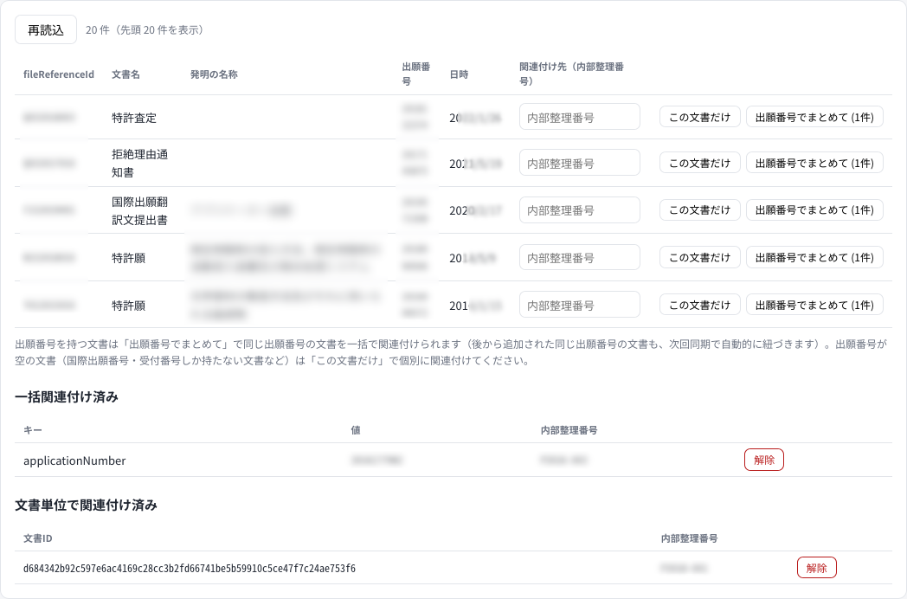

# 運用方法

日々の運用は2つの画面で行う。

- **navi** — 電子データを取り込んで検索できる状態にするまでのパイプライン管制
- **skull** — 文書に整理番号・タグ・担当者を付け、Elasticsearch に反映する

| | 開発環境（既定） | 本番（nginx 経由） |
| --- | --- | --- |
| navi | http://localhost:8005/ | `http://<host>:<port>/navi/` |
| skull | http://localhost:8007/ | `http://<host>:<port>/skull/` |

## 全体の流れ

```
電子データを SRC_DIR に置く
        ↓
navi で「パイプライン開始」            … crow → queen → noir → violet → cendrillon → panther
        ↓
joker で検索できる状態になる
        ↓
skull でメタ情報を登録・関連付け
        ↓
skull で「同期開始」                   … 整理番号・タグ・担当者が検索に反映される
```

新しい電子データが増えたら、この流れをもう一度なぞるだけでよい。
どのサービスも処理済みの文書はスキップするので、毎回全件を流して構わない。

---

# navi — パイプラインを流す


画面は3つの部分からなる。

- **パイプライン** — 6ステージの進行状況と、一括実行の開始・中止
- **サービス** — タスクを持つ6サービスのカード。個別の開始・中止と進捗カウンタ
- **その他のサービス** — タスクを持たない mona / fox / joker / skull の死活監視

## 一括実行

「パイプライン開始」を押すと、crow → queen → noir → violet → cendrillon → panther を
「タスク投入 → 完了までポーリング → 次のステージ」で直列に実行する。
実行中のステージは青、完了したステージは緑になる。

- ステージのタスク自体が `failed` / `canceled` になったときだけチェーンが止まる。
  文書単位の失敗（カウンタの `failed`）ではチェーンは止まらず、警告として表示される
- 「中止」は実行中ステージのタスクを中止してチェーンを止める。
  中止は処理中の1文書が終わってから効き、**再開はしない**（もう一度開始すると、
  未処理の文書だけが処理される）
- パイプラインの状態は navi のメモリ上にしか無い。navi を再起動するとチェーンは
  失われるので、その場合は各サービスカードから続きを手動で開始する

## 個別実行

サービスカードの「開始」で、そのサービスのタスクだけを実行できる。
`max_documents` に件数を入れると、その件数だけ処理して止まる
（空欄なら全件）。新しい環境で動作確認するときや、
特定のステージだけやり直したいときに使う。

カウンタの意味は次のとおり。

| | 意味 |
| --- | --- |
| total | 走査した文書数 |
| succeeded | 実際に処理した文書数 |
| skipped | 出力が既にあってスキップした文書数 |
| failed | 処理に失敗した文書数（直近の失敗は詳細を展開できる） |

2回目以降の実行で `skipped` が総件数と一致すれば、その時点で処理は行き渡っている。

## 覚えておくとよいこと

- 各サービスは**同時に1タスクしか実行しない**。実行中に開始要求を出すと 409 が返る。
  navi はこの排他をサービス側に任せているので、
  同じサービスを一括実行と個別実行で同時に叩いても壊れない
- navi は webhook を使わず、各サービスの
  [taskservice](https://github.com/hyperion13th144m/phantom/blob/main/libs/python/taskservice/README.md) の API をポーリングしているだけで、
  各サービスは navi の存在を知らない。navi が落ちていてもパイプラインは
  各サービスの API から直接動かせる
- navi はアイドル時は何もポーリングしない。UI を開いている間だけ
  `GET /api/services` がファンアウトする

## API で操作する

UI を使わずに動かす場合（cron から回す、など）。

```bash
# パイプライン一括実行
curl -X POST localhost:8005/api/pipeline/start -H 'content-type: application/json' -d '{}'
curl localhost:8005/api/pipeline
curl -X POST localhost:8005/api/pipeline/cancel

# サービス個別
curl -X POST localhost:8005/api/services/crow/start \
  -H 'content-type: application/json' -d '{"params": {"max_documents": 10}}'
curl -X POST localhost:8005/api/services/crow/cancel

# 各サービスを直接叩くこともできる（タスク名は crow=scan, queen=convert,
# noir/violet=extract, cendrillon=ingest, panther=upload, skull=sync）
curl -X POST localhost:8000/tasks -H 'content-type: application/json' \
  -d '{"name": "scan", "params": {}}'
curl localhost:8000/tasks/current
curl localhost:8000/tasks/history
```

## 画像のエンベディングを作り直す

violet のモデルを変えると、既存の画像ベクトルは別の空間のものになって
類似画像検索・画像のセマンティック検索が意味を成さなくなる。全画像の作り直しが要る。

violet は `json/images-properties.json` があるかどうかで処理済みを判定するので、
先に消してから流す。OCR テキストも同じファイルに入っているため、
再実行では OCR もやり直しになる（時間がかかる）。

```bash
find "$PHANTOM_DATA_DIR" -name images-properties.json -delete
curl -X POST localhost:8003/tasks -H 'content-type: application/json' \
  -d '{"name": "extract", "params": {}}'
```

HTML から取り込んだ文書（cendrillon）も同じモデルを使っているので、同じように
消したうえで cendrillon も流す。cendrillon は無い JSON だけを作り直すので、
`document-properties.json` を残しておけばテキスト側は再計算されない。

```bash
curl -X POST localhost:8008/tasks -H 'content-type: application/json' \
  -d '{"name": "ingest", "params": {}}'
```

終わったら panther を流して再投入する。

```bash
curl -X POST localhost:8006/tasks -H 'content-type: application/json' \
  -d '{"name": "upload", "params": {}}'
```

## うまくいかないとき

| 症状 | 見るところ |
| --- | --- |
| ステージが `failed` で止まる | サービスカードの失敗一覧、そのサービスのログ |
| panther がタスクを開始しない | `ES_MAPPING_DIR` にマッピングファイルがあるか、Elasticsearch に繋がるか |
| panther の `skipped` が多い | その文書に `document-properties.json` / `images-information.json` / `images-properties.json` が揃っていない（noir / queen / violet、HTML 入力なら cendrillon を先に流す） |
| 特定の文書だけ作り直したい | 文書ディレクトリの該当する出力 JSON を消して再実行する |
| サービスのランプが赤 | そのサービスが落ちている。`*_URL` の設定と health を確認する |

---

# skull — メタ情報を管理する

skull は、文書に **内部整理番号（主キー）・外部整理番号・タグ・担当者** を付け、
Elasticsearch 上の文書・画像に反映するサービス。
付いたメタ情報は joker の検索対象になる。

## 1. メタ情報を登録する


内部整理番号だけが必須。タグと担当者はカンマ区切りで複数入れられる。
一覧は整理番号・タグ・担当者の部分一致で検索でき、行ごとに編集・削除ができる。

内部整理番号は主キーなので後から変更できない。変える場合は削除して作り直す。

## 2. 文書と関連付ける

文書とメタ情報の結びつけには3つの経路がある。
同じ文書に複数当てはまった場合は、**対象が狭いものほど強い**。

| 優先 | 経路 | どう決まるか |
| --- | --- | --- |
| 弱 | 外部整理番号の一致（自動） | ES の `fileReferenceId` が外部整理番号と一致する文書 |
| ↓ | 内部整理番号の一致（自動） | ES の `fileReferenceId` が内部整理番号と一致する文書 |
| ↓ | 一括関連付け | 書誌キー（既定は出願番号）の値が一致する文書すべて |
| 強 | 文書単位の手動関連付け | その文書1件だけ |

整理番号が一致する文書は登録しただけで自動的に紐づくので、
手当てが必要なのは「一致しなかった文書」だけになる。

## 3. 未対応文書を関連付ける



「未対応文書」は、整理番号に一致せず、どちらの関連付けの対象でもない ES 上の文書。
各行で内部整理番号を入れて、2つのうちどちらかを押す。

- **この文書だけ** — その文書1件を関連付ける
- **出願番号でまとめて (N件)** — 同じ出願番号を持つ文書をまとめて関連付ける。
  N はその時点の該当件数

一括関連付けは**文書IDではなく出願番号の値そのものを保存し、対象文書は同期のたびに
Elasticsearch で解決し直す**。そのため、同じ案件の文書が後から取り込まれても、
次の同期で自動的に紐づく。案件単位で管理したいときはこちらを使う。

> **出願番号が空の文書には一括の操作が出ない。**
> ES 上では空の書誌項目がキー欠落ではなく空文字として入っているため、
> 空の値で一括関連付けを許すと、出願番号を持たない文書がまとめて
> 1つのメタ情報に巻き込まれてしまう。国際出願番号・受付番号しか持たない
> PCT 系の文書などは「この文書だけ」で個別に関連付ける。

関連付けは下の「一括関連付け済み」「文書単位で関連付け済み」の表から解除できる。
メタ情報を削除すると、その関連付けも一緒に消える。

## 4. 同期する


**DB を編集しただけでは検索に反映されない。**「同期開始」を押して初めて
Elasticsearch に書き込まれる。

同期は「あるべき状態」と「現在の状態」を突き合わせて差分だけを反映する
冪等なリコンサイル処理になっている。

- あるべき状態 = DB のメタ情報 × 整理番号一致 + 一括関連付け + 手動関連付け
- 現在の状態 = ES 上で `intRefNumber` が付いている文書
- 差分を文書インデックスに `update`、同じ `docId` の画像に `update_by_query` で反映し、
  対象から外れた文書からはメタ情報フィールドを削除する

この方式なので、panther が文書を再アップロードしてメタ情報が消えても、
同期を実行し直せば復元される。何度実行しても副作用はないので、
迷ったら流してよい（変化が無い文書は `skipped` になる）。

開始時に、メタ情報フィールド（`intRefNumber` / `extRefNumber` / `tags` / `assignees`）の
マッピングを既存インデックスへ冪等に追加する。文書インデックスが無い場合は
タスクを開始しないので、先に panther を実行しておくこと。

API から実行する場合は次のとおり。

```bash
curl -X POST localhost:8007/tasks -H 'content-type: application/json' \
  -d '{"name": "sync", "params": {}}'
curl localhost:8007/tasks/current
curl -X POST localhost:8007/tasks/current/cancel
```

メタ情報の CRUD・関連付け・未対応文書一覧も API で操作できる。
一覧は [skull の README](https://github.com/hyperion13th144m/phantom/blob/main/services/skull/README.md#api) を参照。

## 一括関連付けに使えるキーを増やす

現在使えるキーは出願番号（`applicationNumber`）のみ。
キーの値はそのまま Elasticsearch のフィールド名なので、
`services/skull/src/skull/db.py` の `GROUP_KEY_TYPES` に1行足せば増やせる。
