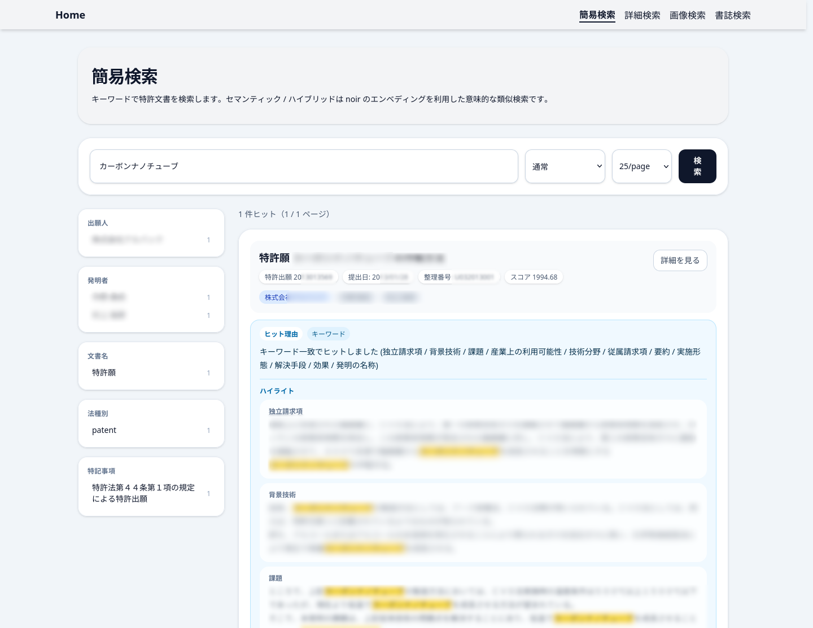
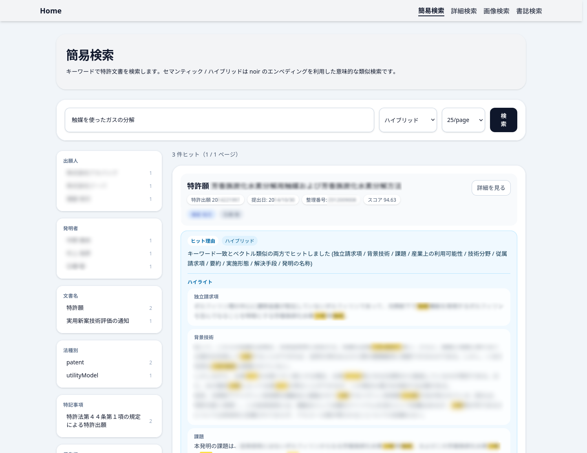
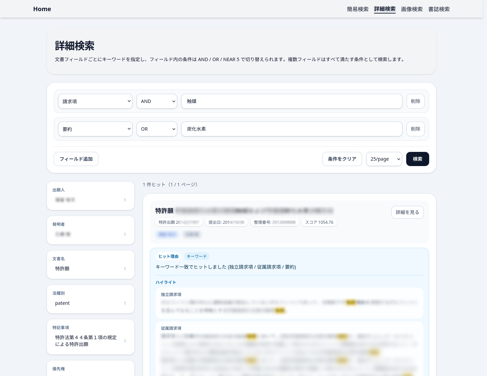
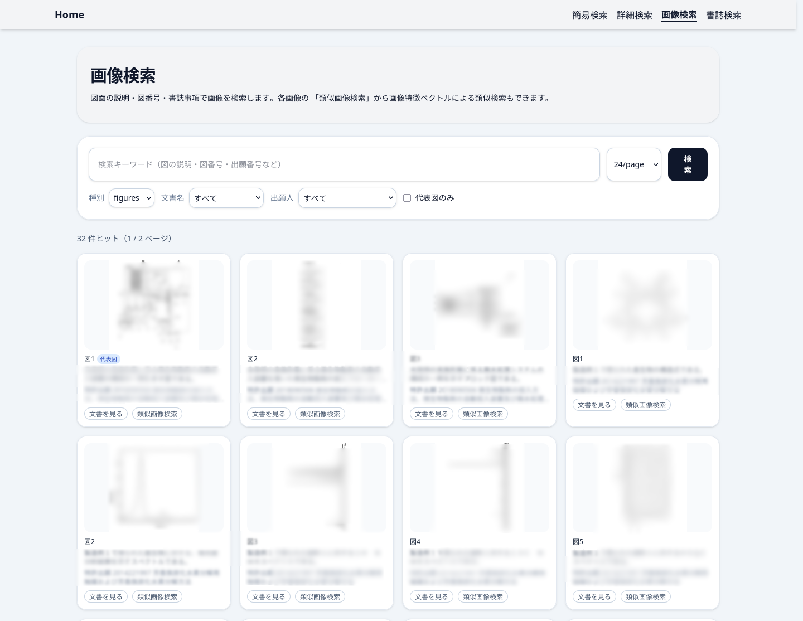
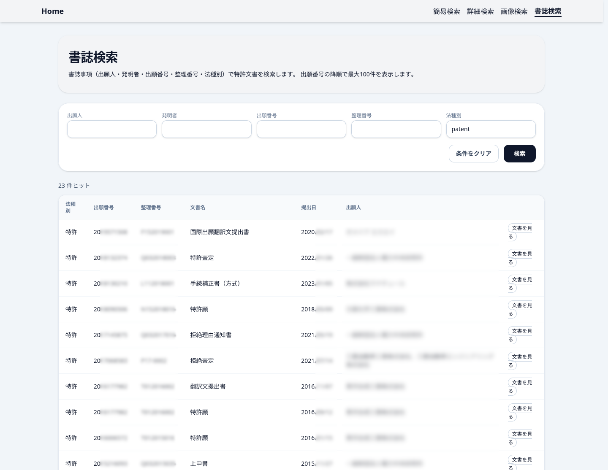
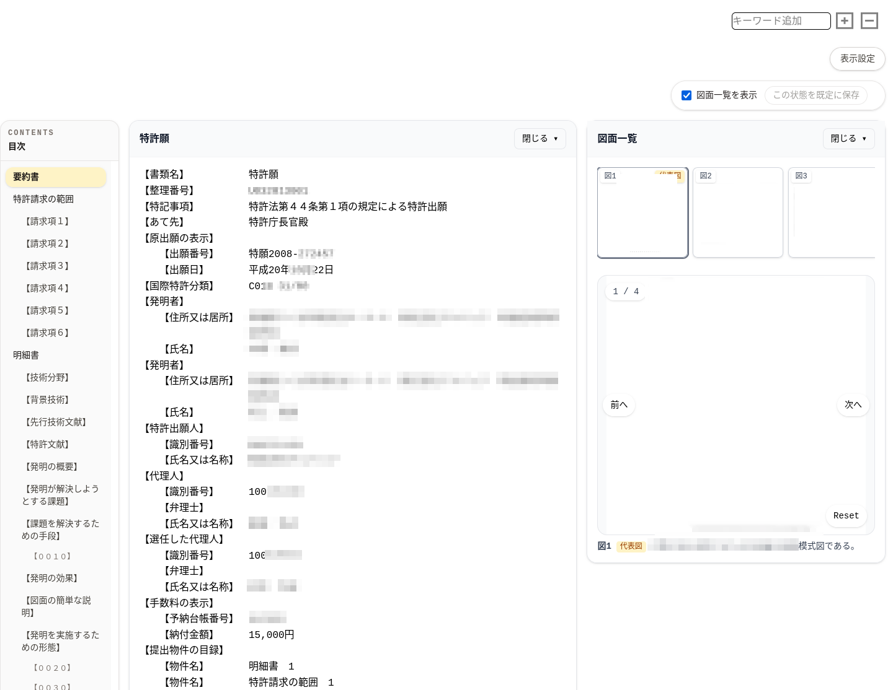

# 検索の使い方（joker）

joker は phantom の検索 UI・検索 API。
開発環境では既定で http://localhost:4322/ 、本番では nginx のルート（`/`）に出ている。

画面は4つ。上部のナビゲーションから行き来できる。

| 画面 | パス | 用途 |
| --- | --- | --- |
| [簡易検索](#簡易検索) | `/search` | キーワード1本で本文を横断検索する |
| [詳細検索](#詳細検索) | `/detail` | 請求項・要約などフィールドを指定して検索する |
| [画像検索](#画像検索) | `/imageSearch` | 図面を探す。似た図面も探せる |
| [書誌検索](#書誌検索) | `/docList` | 出願人・出願番号などから案件を一覧する |

---

## 簡易検索



キーワードを入れて検索する。検索モードを4つから選べる。

| モード | 何をするか | 向いている場面 |
| --- | --- | --- |
| **通常** | 形態素（kuromoji）と 2-gram を重み付きで併用したキーワード検索 | まずはこれ。表記ゆれや部分一致も拾う |
| **厳密** | フレーズ一致のみ | 用語をそのままの並びで含む文書だけが欲しいとき |
| **セマンティック** | 検索フレーズをベクトル化し、文書ベクトルとの意味の近さで並べる | 言い回しが分からない・別の言葉で書かれていそうなとき |
| **ハイブリッド** | 通常のスコアとセマンティックのスコアを合算する | 迷ったらこれ。キーワードが効く文書も意味が近い文書も拾える |



セマンティック / ハイブリッドは、検索フレーズを noir の
`POST /embeddings/query` で文書と同じモデル（既定 `cl-nagoya/ruri-v3-130m`・512次元）の
ベクトルに変換して使う。**noir が起動している必要がある。**

### 検索対象

通常・厳密・ハイブリッドのキーワード部分は、本文と書誌をまとめて検索する。
重みは請求項がいちばん高く、以下、要約 → 発明の名称 → 実施形態・各セクションと続く。

- **本文** — 独立請求項・従属請求項・要約・発明の名称・実施形態・意見の内容・
  技術分野・背景技術・課題・解決手段・効果・産業上の利用可能性・
  拒絶理由・拒絶理由結論・補正の内容 など
- **番号類** — 出願番号・登録番号・国際出願番号・審判番号・受付番号・整理番号。
  keyword フィールドなので完全一致に強く、部分一致は 2-gram が拾う
- **人名** — 出願人・発明者
- **OCR テキスト** — 図面から violet が読み取ったテキスト。
  英語（ステミングあり）・日本語（kuromoji）・部分一致（2-gram）を同時に当てる

### 絞り込み

結果の左に集計（ファセット）が出る。出願人・発明者・文書名・法種別・特記事項・
拒絶理由・優先権で、件数を見ながら絞り込める。

### 結果の見方

各ヒットには次が表示される。

- **ヒット理由** — キーワード一致 / ベクトル類似 / その両方のどれで当たったか、
  どのフィールドに当たったか
- **ハイライト** — 一致箇所を含むフィールドの抜粋（検索語が黄色くなる）
- **スコア** — 並び順の根拠。モードが違うとスケールも変わるので、
  別の検索の値と比べても意味は無い
- **詳細を見る** — fox の文書ページへ移動する

---

## 詳細検索



フィールドごとにキーワードを指定する。行は「フィールド追加」で増やせる。

- **フィールド** — 請求項（独立+従属）・独立請求項・従属請求項・要約・実施形態・
  意見の内容・発明の名称・技術分野・背景技術・課題・解決手段・効果・
  産業上の利用可能性・受託番号・国等の委託研究の成果に係る記載事項・
  拒絶理由・拒絶理由結論・補正の内容・OCR処理テキスト
- **演算子** — キーワードをスペース区切りで複数入れたときの、そのフィールド内の扱い
  - `AND` — すべて含む
  - `OR` — どれかを含む
  - `NEAR 5` — 5語以内の近さで並んでいる
- **複数の行を足した場合は、すべての行を満たす文書**（行どうしは AND）になる

「請求項に "触媒" があり、かつ要約に "炭化水素" か "分解" のどちらかがある」
といった絞り込みができる。左の集計での絞り込みは簡易検索と同じ。

---

## 画像検索



図面を1枚ずつのカードで探す。サムネイルは queen が作った WebP を使っている。

- **キーワード** — 図の説明・図番号・その図が載っている文書の書誌（出願番号など）に当たる
- **検索モード** — **通常**は上記のキーワード検索。**セマンティック**は検索フレーズを
  violet の `POST /embeddings/query` で画像と同じ CLIP 空間のベクトルに変換し、
  画像そのものとの類似度で並べる。図の説明が無い画像も対象になる。
  モデルは多言語版の CLIP（`xlm-roberta-base-ViT-B-32` / `laion5b_s13b_b90k`）なので
  日本語のフレーズで引ける。**violet が起動している必要がある。**
- **種別** — `figures`（図面）/ `chemical-formulas`（化学式）/ `tables`（表）/
  `other-images`（その他）
- **文書名 / 出願人** — 集計から選んで絞り込む
- **代表図のみ** — 各文書の代表図だけを見る

各カードの操作は2つ。

- **文書を見る** — その図が載っている文書を fox で開く
- **類似画像検索** — その画像の特徴ベクトル（open_clip xlm-roberta-base-ViT-B-32・512次元）に近い順に
  並べ直す。文言に依らず「形が似ている図」を探せる。参照した画像自身は結果から除かれる

---

## 書誌検索



出願人・発明者・出願番号・整理番号・法種別で案件を一覧する。
本文は見ずに「この出願人の書類を一通り見たい」というときに使う。
出願番号の降順で最大100件まで表示する。

---

## 文書を見る（fox）

検索結果の「詳細を見る」「文書を見る」から、文書ビューア fox に移動する。



左が目次、中央が本文、右が図面一覧。図面はサムネイルを選ぶと大きく表示され、
図番号・説明・代表図バッジが下に出る。「前へ」「次へ」で送れるほか、
90°回転（`Reset` で戻る）とドラッグでの移動ができる。
右上の「キーワード追加」で本文中の語をハイライトでき、
「表示設定」で表示項目を調整できる（`この状態を既定に保存` で次回以降に引き継がれる）。
印刷用のページは URL の末尾に `/print` を付ける。

---

## API から使う

画面と同じ検索を JSON で取得できる。

```bash
# 簡易検索（mode=keyword|semantic|hybrid、strict=true で厳密）
curl -G localhost:4322/api/search \
  --data-urlencode 'q=カーボンナノチューブ' --data-urlencode 'mode=hybrid' \
  --data-urlencode 'size=10' --data-urlencode 'withHighlight=true'

# 詳細検索（advanced は JSON 配列）
curl -G localhost:4322/api/search \
  --data-urlencode 'advanced=[{"field":"Claims","operator":"and","query":"触媒"}]'

# 画像検索 / 類似画像検索
curl -G localhost:4322/api/imageSearch --data-urlencode 'kind=figures'
curl -G localhost:4322/api/imageSearch --data-urlencode 'similarImageId=<docId>/<filename>'

# 書誌検索
curl -G localhost:4322/api/docList --data-urlencode 'applicants=東洋合成工業'
```

パラメータの一覧は [joker の README](https://github.com/hyperion13th144m/phantom/blob/main/services/joker/README.md#api) を参照。

---

## メタ情報での検索

skull で付けた内部整理番号・外部整理番号・タグ・担当者は、
文書・画像の両インデックスに書き込まれる。
付与するには skull で登録・関連付けをして同期を実行する
（[運用方法](operations.md#skull--メタ情報を管理する)）。

## うまくヒットしないとき

| 症状 | 対処 |
| --- | --- |
| セマンティック / ハイブリッドがエラーになる | noir が起動しているか、`NOIR_URL` が正しいかを確認する |
| 語句を含むはずの文書が出てこない | 厳密モードを外す。区切りが想定と違う可能性があるので 2-gram が効く「通常」で試す |
| 図面がヒットしない | 図の説明は XML 由来なので、説明が無い図はキーワードでは当たらない。画像検索のセマンティックモードか類似画像検索を使う |
| 画像のセマンティック検索がエラーになる | violet が起動しているか、`VIOLET_URL` が正しいかを確認する |
| 画像のセマンティック検索が1件も返らない | 画像に `embeddings` が無い。violet を実行して panther で再投入する |
| 図中の文字で探したい | OCR テキストは**文書側**に集約されているので、簡易検索か詳細検索の「OCR処理テキスト」で探す |
| 新しく取り込んだ文書が出てこない | panther まで流れているかを navi で確認する |
